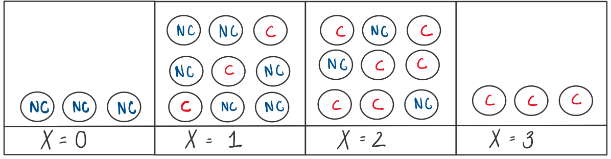
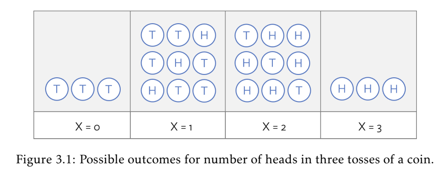
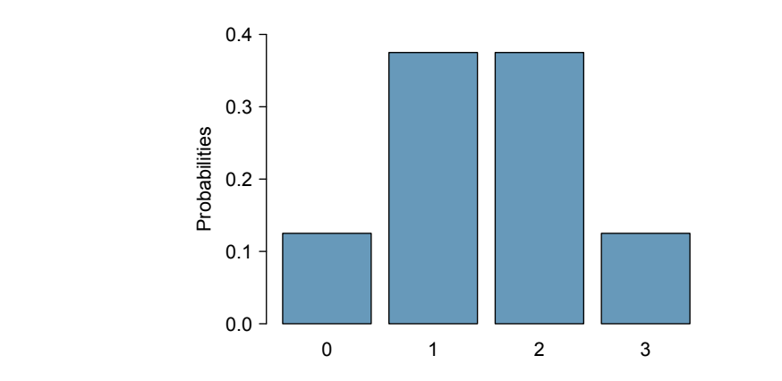
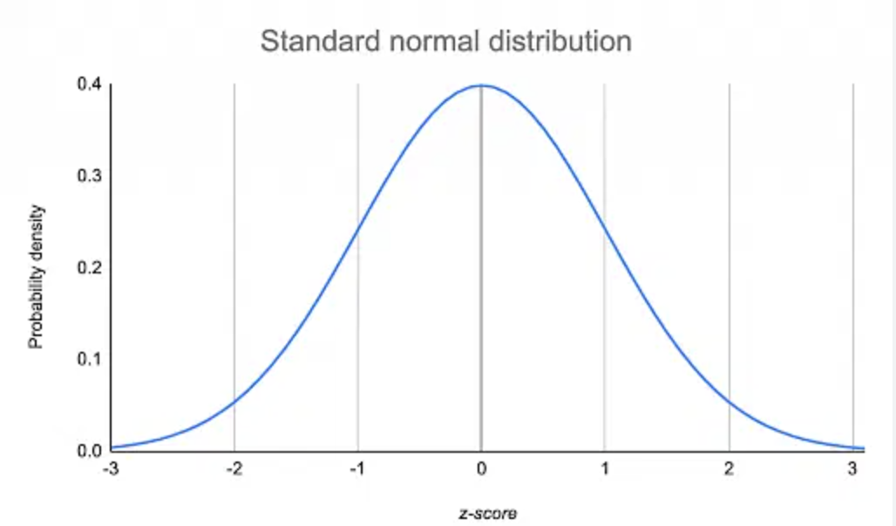
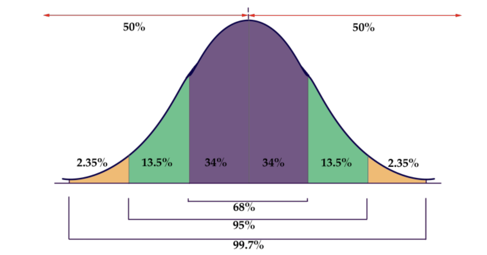
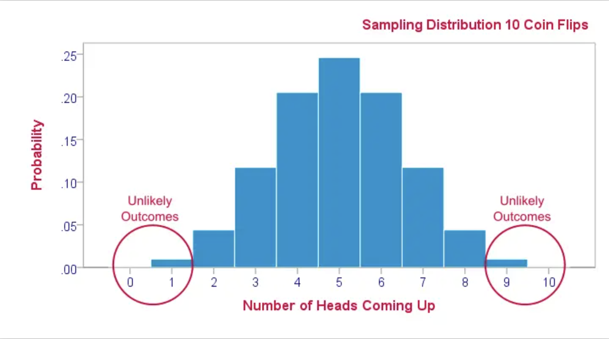

```{r echo=FALSE, message=FALSE, warning = FALSE}
library(knitr)

knitr::opts_chunk$set(message = FALSE, warning = FALSE)

hook_output = knit_hooks$get('output')
knit_hooks$set(output = function(x, options) {
  # this hook is used only when the linewidth option is not NULL
  if (!is.null(n <- options$linewidth)) {
    x = xfun::split_lines(x)
    # any lines wider than n should be wrapped
    if (any(nchar(x) > n)) x = strwrap(x, width = n)
    x = paste(x, collapse = '\n')
  }
  hook_output(x, options)
})

```


### Announcements

- **Project Proposal**
  - due Tuesday February 25
- **Lab 4** in class Thursday February 27
  - due Friday February 28 at 11:59pm in Blueline
- **Homework 4**
  - due Thursday March 6

  
  
<br>
<br>

**Book Chapters**: Section 3.1, 3.3, 4.1 and 4.2

---
### Agenda

- Random Variables
- The Normal Distribution
- Sampling Distributions
- Confidence Intervals
- Central Limit Theorem


---
class:inverse

<br>
<br>
<br>
<br>
<br>
<br>
<br>
.center[
## Random Variables and Probability Distributions
]
---
### Random Variables


- Last week, we talked about the probability of an event.    
  + **Example**: let `C` be the event that a person is diagnosed with Cancer, we have `P(C)`.
- Now suppose we have three people, and we are wondering what is the probability that exactly one of them is diagnosed with Cancer.

A **random variable** is a **function** that maps each event in a sample space to a number.

<br>
<br>
<br>
<br>
  
```{r, echo=FALSE, out.width="80%", fig.align='center'}

```  

---
### Random Variables

Let's consider a more familiar random phenomenon: a coin flip

If a coin is tossed three times, the outcome is a sequence of observed heads and tails

```{r, echo=FALSE, out.width="70%", fig.align='center'}

```

<br>
<br>
<br>

The random variable $X$ is the number of heads for the three tosses.

---
### Probability Distribution

Probability distribution: a list of the probabilities of all mutually exclusive outcomes of random variable

- We can assign probabilities to values of a random variable. 

---
### Probability Distribution

We can use bar graphs to display the distribution of a random variable

```{r, echo=FALSE, out.width="90%", fig.align='center'}

```

Rules:

+ Outcomes must be mutually exclusive
+ Each probability must be between 0 and 1
+ Probabilities must sum to 1

---
### Probability Distribution

Based on the potential outcomes of a random variable, we can classify random variables and their distribution into continuous and discrete. 
  + Discrete random variable: probability mass function (p(y))
    - The number of people enter the clinic 
  + Continuous random variable: probability density function (f(y))
    - The proportion of people recovered with the new drug


---
class:inverse

<br>
<br>
<br>
<br>
<br>
<br>
<br>
.center[
## The Normal Distribution
]

---
### Example: Let's Start with an Example

The forced expiratory volume (FEV, measured in liters) is a primary indicator of successful lung function and corresponds to the volume of air that can be forcibly blown out in the first second after fully breathing in. A study of FEV on a sample of n = 654 children measured the children’s age, FEV, height, sex, and whether they had been exposed to second-hand smoke.

.pull-left[
```{r, echo=FALSE, message=FALSE}
library(tidyverse)
fev <- read.csv("data/FEV.csv")

fev %>% ggplot(aes(x=fev)) +
  geom_density(color="black", fill="blue")

```

].pull-right[
```{r, echo=FALSE}
fev %>% ggplot(aes(x=height)) +
  geom_density(color="black", fill="blue")

```

]

---
### Normal Distribution

**Normal Distribution**: the probability distribution that generates a perfect “bell-shaped curve”
  - A continuous probability distribution
  - Two parameters: mean $(\mu)$ and standard deviation $(\sigma)$.
    + Notation: $N(\mu, \sigma)$ 


```{r, echo=FALSE, fig.align='center', fig.height=5.5}

ggplot(data.frame(x = c(-3, 3)), aes(x = x)) +
        stat_function(fun = dnorm) + ylab("Density")

```

---
### Properties of the Normal Model

- Symmetric and unimodal around the mean $\mu$
- The standard deviation $\sigma$ controls the spread the distribution

```{r, echo=FALSE, fig.align='center'}
knitr::include_graphics("../05-Inference-Foundations/images/normal-dist.png")
```

---
### Relationship between Density and Probability

- The area under the probability density function is 1
  - Probability is measured by the area under the curve. e.g., the shaded area in the figure represents the P(−2 < X < 0)
  - Note: For a continuous variable, at any point x, P(X = x) = 0

```{r, echo= FALSE,  fig.height=6, fig.align='center'}
# Return dnorm(x) for 0 < x < 2, and NA for all other x
dnorm_limit <- function(x) {
    y <- dnorm(x)
    y[x > 0  |  x < -2] <- NA
    return(y)
}

# ggplot() with dummy data
p <- ggplot(data.frame(x = c(-3, 3)), aes(x = x))

p +
  stat_function(fun = dnorm_limit, geom = "area", fill = "blue", alpha = 0.2) +
  stat_function(fun = dnorm) + ylab("Density")
```


---
### Finding Normal Probabilities

The probability density function for the normal distribution is:

$$f(x) = \frac{1}{\sqrt{2\pi\sigma^2}}e^{−(x−μ)^2/2\sigma^2}$$

How do we find the area under it?

 + Traditional chart reading with Z score
 + Use R as a calculator
 
 
---
### Z-Score

- Comparing values across different normal distributions can be tricky.
  - Solution: convert all normal distribution with different $\mu$ and $\sigma$ to a standard normal distribution.
- For a random normal distribution, we can always define a new random variable Z, such that $$Z = \frac{X − \mu}{\sigma},$$ then Z will follow a standard normal distribution with mean equal to 0 and standard deviation equals to 1.


**Essentially**: if $X \sim N(\mu, \sigma^2) \text{ then }  Z = \frac{X − \mu}{\sigma} \sim N(0,1)$ 

  - [Proof](https://online.stat.psu.edu/stat414/lesson/16/16.2)

---
### Z-Score

- Quantifies how far the observation is from the mean, in units of standard deviation
  - Observations above the mean have positive Z-scores, while observations below the mean have negative Z-scores.

```{r, echo=FALSE, fig.align='center', out.height="90%", out.width="90%"}

```

---
### Standard Normal Distribution

The Standard Normal $(N(0,1))$ distribution is well-studied

<br>

- A normal probability table can be used to identify the percentile corresponding to any particular Zscore.
  + Z-score chart that records all the probabilities of the standard normal distribution from $-\infty$ to a certain value ([link to chart](https://www.z-table.com/)). 
- `R function`: `xpnorm`
- Online Calculator: https://istats.shinyapps.io/NormalDist/

---
### Standard Normal Distribution
.pull-left[
```{r, echo= FALSE, out.width="90%", fig.align='center'}
# ggplot() with dummy data
dnorm_limit <- function(x) {
    y <- dnorm(x)
    y[x > -1  |  x < -3] <- NA
    return(y)
}

p1 <- ggplot(data.frame(x = c(-3, 3)), aes(x = x))

p1 +
  stat_function(fun = dnorm_limit, geom = "area", fill = "blue", alpha = 0.4) +
  stat_function(fun = dnorm) + ylab("Density")
```
].pull-right[
```{r, echo= FALSE, out.width="90%", fig.align='center'}
# ggplot() with dummy data
# ggplot() with dummy data
dnorm_limit <- function(x) {
    y <- dnorm(x)
    y[x > 1  |  x < -1] <- NA
    return(y)
}

p2 <- ggplot(data.frame(x = c(-3, 3)), aes(x = x))

p2 +
  stat_function(fun = dnorm_limit, geom = "area", fill = "blue", alpha = 0.4) +
  stat_function(fun = dnorm) + ylab("Density")
```
]

If you want to calculate $P( a < X < b)$, then $$ P( a < X < b) = P( -\infty < X < b) = P( -\infty < X < a)$$

---
### Application: FEV

Assume forced expiratory volume (FEV) follows a normal model with $\mu$ = 2.64 and $\sigma$ = 0.87. Find the probability that a child has FEV less than 1.5. First let's calculate the z-score.

---
### Application: FEV

Assume forced expiratory volume (FEV) follows a normal model with $\mu$ = 2.64 and $\sigma$ = 0.87. Find the probability that a child has FEV less than 1.5.

```{r, echo=FALSE}
library(mosaic)
```

In the `mosaic` package in R, we have a function called `xpnorm`

```{r, message=FALSE, out.width="40%", fig.align='center'}
xpnorm(q=1.5, mean = 2.64, sd=0.87)
```

---
### Application: Birth Weights

The babies born in single births in the United States have birth weights that are approximately normally distributed with mean 3.3 kg and standard deviation 0.56 kg. For both questions, calculate the Z-score by hand first.

- What is the probability of a baby with a born weight between 3 kg and 4 kg?
- What is the probability of a baby with a born weight more than 5 kg?

---
### Probability of a baby with a born weight between 3 kg and 4 kg?

If X ~ N(3.3, 0.56) then
.pull-left[

```{r, message=FALSE, out.width="90%"}
xpnorm(3, mean=3.3, sd=0.56)
```

].pull-right[

```{r, message=FALSE, out.width="90%"}
xpnorm(4, mean=3.3, sd=0.56)
```

]

---
### Probability of a baby with a born weight more than 5 kg?

---
### Probability of a baby with a born weight more than 5 kg?


.center[
```{r, message=FALSE, fig.height=5}
xpnorm(5, mean=3.3, sd=0.56)
```
]

---
### Your Turn: Spy Height

It was rumored that Britain’s domestic intelligence service MI5 has an upper limit on the height of its spies, on the assumption that tall people stand out. (For the record - they deny this.) The rumor says that, to apply to be a spy, you can be no taller than 5 feet 11 inches (180.3 cm) if you are a man, and no taller than 5 feet 8 inches (172.7 cm) if you are a woman – supposedly to allow the spies to blend in with a crowd. Adult heights are known to be approximately normally distributed. For males, x ∼ N(177.0, 7.1) and for females, x ∼ N(163.3, 6.4).

+ What proportion of British males are eligible to apply to MI5?
+ What proportion of British females are eligible to apply to MI5?

Sketch a graph of both distributions to help you out and calculate Z-score by hand first.

---
### Your Turn: Spy Height

.pull-left[
What proportion of British males are eligible to apply to MI5?


].pull-right[
What proportion of British females are eligible to apply to MI5?

]


---
### Empirical Rule

A simple rule for working with the normal model is the Empirical Rule:

- Approximately 68% of all probability in a normal model is within $\mu \pm \sigma$
- Approximately 95% of all probability in a normal model is within $\mu \pm 2\sigma$
- Approximately 99.7% of all probability in a normal model is within $\mu \pm 3\sigma$

```{r, echo=FALSE, fig.align='center'}

```


---
### Application: Birth Rate

The babies born in singleton births in the United States have birth weights that are approximately normally distributed with mean 3.296 kg and standard deviation 0.560 kg.

+ Give a range for the central 68% of all birth weights.
+ Give a range for the central 95% of all birth weights.
+ Give a range for nearly all birth weights (99.7%).

---
### Find the quantile for a random probability

What if the question is asking about a random probability?

To convert a value from the standard normal curve (Z) to one on the normal distribution $N(\mu, \sigma)$: $$X = \mu + Z\sigma$$

---
### Find the quantile for a random probability

Assume FEV follows a normal model with $\mu$ = 2.64 and $\sigma$ = 0.87. Find the lung capacity of the lowest 40% of children.

```{r, message=FALSE, out.width="45%", fig.align='center'}
xqnorm(0.40, mean=2.64, sd=0.87)
```
---
### Your Turn: Birth Rate

The babies born in singleton births in the United States have birth weights that are approximately normally distributed with mean 3.296 kg and standard deviation 0.560 kg.

+ Find the birth rate of the lowest 20% of babies
+ Find the birth rate of the highest 40% of babies

---
### Does the data ”fit” a normal model?

The normal distribution can be used to approximate other distributions. 
- In order to continue with using the normal distribution, we must test the appropriateness of this assumption

<br>

**QQ plot**: a quantile-quantile plot plots the sample values from our data against the corresponding "theoretical quantiles" from a normal distribution using converted z-scores
+ The closer the QQ plot is to a straight line, the better our data ”fits” a normal model.
+ No QQ plot will be exactly perfect. Look for obvious deviations!

---
### What to expect in a QQ plot

The data sets below were all generated using a N(0, 1) model.

```{r, message=FALSE,fig.align='center', echo = FALSE, fig.height=7, fig.width=10}

set.seed(10)
data1 <- data.frame(value = rnorm(n=30, mean=0, sd=1), type = "Small (n=30)")
data2 <- data.frame(value = rnorm(n=100, mean=0, sd=1), type = "Medium (n=100)")
data3 <- data.frame(value = rnorm(n=300, mean=0, sd=1), type = "Large (n=300)")
data <- rbind(data1, data2, data3)
data$type <- factor(data$type, levels = c("Small (n=30)", "Medium (n=100)", "Large (n=300)"))

data %>% 
  ggplot(aes(x=value, fill = type, group = type)) + 
  geom_histogram(aes(y = after_stat(density)), bins = 15) +
  stat_function(fun = dnorm, args = list(mean=mean(data$value), sd=sd(data$value))) +
  facet_wrap(vars(type))
```

---
### What to expect in a QQ plot

The data sets below were all generated using a N(0, 1) model.

```{r, message=FALSE, fig.align='center', echo = FALSE, fig.height=7, fig.width=10}
data %>% ggplot(aes(sample=value, color = type)) + facet_wrap(vars(type)) +
  stat_qq() + stat_qq_line()
```


---
### What to expect in a QQ plot

What happens when we have clearly non-normal data sets?


```{r, echo=FALSE, fig.align='center', fig.height=7, fig.width=10}
set.seed(12345)
data1 <- data.frame(value = c(rbeta(15, 10, 3), rbeta(15, 3, 10)), type = "Bimodal")
data2 <- data.frame(value = rbeta(30, 10, 3), type = "Left Skew")
data3 <- data.frame(value = rbeta(30, 3, 10), type = "Right Skew")

data <- rbind(data1, data2, data3)

data %>% 
  ggplot(aes(x=value, fill = type, group = type)) + 
  geom_histogram(aes(y = after_stat(density)), bins = 30) +
  stat_function(fun = dnorm, args = list(mean=mean(data$value), sd=sd(data$value))) +
  facet_wrap(vars(type)) 

```


---
### What to expect in a QQ plot

What happens when we have clearly non-normal data sets?

```{r echo=FALSE, fig.align='center', fig.height=7, fig.width=10}
data %>% 
  ggplot(aes(sample=value, color = type)) + facet_wrap(vars(type)) + 
  stat_qq() + stat_qq_line()
```


---
### Application: Height

Would it be reasonable to model height of children using a normal distribution?

.pull-left[
```{r echo=FALSE, fig.align='center', fig.height=8.5, fig.width=10}
fev %>% 
  ggplot(aes(x=height)) + geom_density(color="black", fill="blue")
```

].pull-right[
```{r echo=FALSE, fig.align='center', fig.height=8.5, fig.width=10}
fev %>% 
  ggplot(aes(sample=height)) +
  stat_qq() + stat_qq_line()
```
]

---
class:inverse

<br>
<br>
<br>
<br>
<br>
<br>
<br>
.center[
## Sampling Distributions
]

---
### Review on Population and Sample

- We have discussed the concept of population and sample.
  - In the "real world" we won't have access to the population data.
  - A good sample should be able to represent the population's characteristics
- Let's begin to answer the question on how to use the samples to understand the population

---
### Estimating Population Parameters

**Example**: The Centers for Disease Control (CDC) uses survey data to estimate features of health from samples of the US population. These surveys include:

- National Health Interview Survey (NHIS)
- National Health and Nutrition Examination Survey (NHANES)
- Behavioral Risk Factor Surveillance System (BRFSS)
  - The data set *cdc* contains a small number of variables from a random sample of 20,000 BRFSS responses from the year 2000. 

```{r, echo=FALSE}
cdc <- read.csv("../05-Inference-Foundations/data/cdc.csv")
head(cdc)
```


---
### Sample Statistics

- Suppose we pretend that the *cdc* data set represents the entire population of American adults
  - Let's randomly select 60 rows from the 20,000 responses as our sample.

```{r, echo=FALSE}

set.seed(4)
cdc_sample <- sample_n(cdc, 60)          
head(cdc_sample, n = 4) 

```

<br> 

- A natural way to estimate the population parameter is to calculate the corresponding **sample statistic**
  + Population mean $(\mu)$ $\longrightarrow$ sample mean $(\bar{x})$
  + Population standard deviation $(\sigma)$ $\longrightarrow$ sample standard deviation $(s)$
  

---
### Variability in Estimates

Suppose we want to study the weight variable

.pull-left[
Here is the population mean $\mu$ = 

```{r, echo=FALSE}
mean(cdc$weight)
```
].pull-right[
Here is the sample mean $\bar{x}$ = 
```{r, echo=FALSE}
mean(cdc_sample$weight)
```
]


Close! But not exactly right! How could we get a more accurate sample?


<br>
<br>
<br>
<br>
<br>
<br>
<br>
<br>

**Note**: The sample mean is also called a **point estimate**
---
### Variability in Estimates

What if the sample size is fixed, but we can take multiple samples? Other random samples of 60 from the population may produce different $\bar{x}$ values.

Means of two more random samples of size 60:

```{r, echo=FALSE}

set.seed(44)
cdc_sample <- sample_n(cdc, 60)          
print(paste("Sample Mean 1:", mean(cdc_sample$weight)))

set.seed(444)
cdc_sample <- sample_n(cdc, 60)          
print(paste("Sample Mean 2:", mean(cdc_sample$weight)))

```


---
### Variability in Estimates

What are the takeaway points?

- Random samples tend to produce sample statistics that are reasonably close to the population parameter.
  - Some samples are "unlucky": they may overestimate or underestimate the population parameter 
  + There aren't very many of these!
- The distribution of sample statistics has a symmetric, bell-shaped curve appearance.

---
### Sampling Distribution

**Sampling Distribution**: the probability distribution of all possible values of a sample statistics

- Every statistic has a sampling distribution. Focus:
  + Quantitative response: mean $(\bar{x})$
  + Categorical response: proportion $(\hat{p})$
- To describe a sampling distribution, we'll need to know three things:
  - Center (mean)
  - Variation (standard error)
  - Shape

  
```{r, echo=FALSE, fig.align='center', out.width="70%"}


```

---
### Standard Error

**Standard Error**: a measure of the **sample-to-sample variability** of the sample statistic.

- How far away we expect a "typical" sample statistic to be from the true population parameter. 
- Standard error is the standard deviation of the sample distribution.


<br>
<br>
<br>

```{r, echo=FALSE, fig.align='center', out.width="70%"}

knitr::include_graphics("../05-Inference-Foundations/images/sd-vs-se.png")
```


---
### Standard Error

Sampling Distributions provide the theoretical basis for **statistical inference**: learning about a population based on a sample.

The sampling distribution of $\bar{x}$ has:

- Mean $(\mu)$
- Standard Error $(SE_{\bar{x}})$ = $\frac{s}{\sqrt{n}}$
  + $s$ is the sample standard deviation
- Shape: approximately normally distributed, as long as $n$ is "large enough"


<br>
<br>
<br>

.center[
**This is true even if the random variable does not follow a normal distribution.**
]

---
### Calculating Standard Error

Summary Statistics from our initial sample:

```{r, echo=FALSE}
set.seed(4)
cdc_sample <- sample_n(cdc, 60)
favstats(cdc_sample$weight)
```


---
class:inverse

<br>
<br>
<br>
<br>
<br>
<br>
<br>
.center[
## Confidence Intervals
]


---
### Statistical Inference

- Can we find a reasonable estimate or set of estimates for our population parameter?
  + ie. Given a sample, instead of providing a point estimate to the population parameter, we can give a range of value based on the level of confidence we want.
  
- Has our population parameter increased/decreased/changed compared to some other value?
  + ie. What if my sample sizes increases, how will the other values change
  
---
### Confidence Intervals

**Confidence Intervals**: a range of the most plausible or believable values for the population parameter, based on a sample of data. General formula:  
<br>

$$\text{sample statistic} \pm \text{margin of error}$$

<br>
The margin of error (MOE) reflects how uncertain we are about the accuracy of our original sample statistic. 

<br>


Large MOE $\longrightarrow$ wide confidence interval $\longrightarrow$ more confidence that the true estimate will be in the interval

Small MOE $\longrightarrow$ narrow confidence interval $\longrightarrow$ less confidence that the true estimate will be in the interval

---
### Confidence Intervals for $\mu$

Suppose we’re interested in estimating the population mean, $\mu$. Based on the sampling distribution, we know that, as long as our sample size is "large enough", we will have

$$\mu - 1.96 \cdot SE_{\bar{x}} < \bar{x} < \mu + 1.96 \cdot SE_{\bar{x}}$$

---
### Interpretation of a Confidence Interval

Correct Interpretation of a 95% confidence interval:

- If repeated samples were taken, 95% of intervals calculated from those samples will contain the true population mean
- We are 95% confident that the population mean is in the interval

Wrong Interpretation of a 95% confidence interval:

- There is a 95% chance that the true population mean lies within the confidence interval
- 95% of the data will fall into the interval
- If we take another sample, there is a 95% chance the sample mean will be in the interval

---
### Application: CDC

We know that in the CDC data set, the overall mean population weight is $\mu$ = 169.683. Let's pretend we don't know this value (which we usually don't). How often will a confidence interval contain this value?

```{r, echo=FALSE, fig.align='center', fig.height=6, fig.width=10}
set.seed(240)
n <- 100
num_trials <- 100
cdc_means <- 1:num_trials %>%
  map_dfr(~ cdc %>%
            slice_sample(n = n) %>%
            summarize(mean_weight = mean(weight), sd_weight = sd(weight))) %>% mutate(n = n)


cdc_means2 <- cdc_means %>%
  mutate(
    se = sd_weight/sqrt(n),
    ci_lower = mean_weight - 2 * se, # approximately 95% of observations 
    ci_upper = mean_weight + 2 * se,  # are within two standard errors
    sample = 1:100,
    group = ifelse(169.67 <= ci_upper & 169.6 >= ci_lower, "1", "2")
  )

pd <- position_dodge(0.78)

ggplot(cdc_means2, aes(x=sample, y = mean_weight)) +
  #draws the means
  geom_point(position=pd) +
  #draws the CI error bars
  geom_errorbar(data=cdc_means2, aes(ymin=ci_lower, ymax=ci_upper, color = group), width=.1, position=pd) + geom_hline(yintercept = 169.383, linetype = "dashed") + ylab("Confidence Interval")
```


---
### Let's Calculate a 95% Confidence Interval!

Reminder, for our sample: 
  - $\bar{x}$ = 171.4833
  - $s$ = 39.7942
  - $n$ = 60


---
### Let's Interpret the Interval!

Interpret the confidence interval you calculated on the previous slide for the mean population weight of US Adults


---
### Application : BMI

Example: Body mass index (BMI) is one measure of body weight that adjusts for height. The national Health and Nutrition Examination Survey (NHANES) consists of a set of surveys and measurements conducted by the CDC to assess the health and nutritional status of adults and children in the US. Following is summary statistics of BMI of a random sample of 200 individuals from 2009-2010 and 2012-2013. Calculate and interpret a 95% confidence interval for adult BMI.

```{r, echo=FALSE}
x <- data.frame(min = 13.1, Q1 = 20.9, median = 26, Q3 = 30.7, max = 69, mean = 26.6, sd = 8, n = 190, missing = 10)
kableExtra::kable(x)
```

---
### Application : BMI

If the a healthy range of BMI is [18.5, 24.9], does this suggest that Americans tend to be overweight?


---
### Application : BMI

We can also think about this problem using probability: recall $\bar{x} \sim N(\mu, SE_{\bar{x}})$


What is the probability that the difference between the true mean and sample mean is within 0.5 units?


---
### Changing the Confidence Level

$$\bar{x} \pm z^* \cdot SE_{\bar{x}}$$


<br>
<br>
What if we want to have a different confidence level - say 90%?
- For a 90% confidence level, use z* = 1.645
- For a 95% confidence level, use z* = 1.96
- For a 99% confidence level, use z* = 2.58
- For any other confidence level, use the standard normal distribution to find z directly.


---
### Changing the Confidence Level

```{r, echo=FALSE, warning=FALSE, fig.align='center', fig.height=7, fig.width=10}
set.seed(240)
n <- 100
num_trials <- 10
cdc_means <- 1:num_trials %>%
  map_dfr(~ cdc %>%
            slice_sample(n = n) %>%
            summarize(mean_weight = mean(weight), sd_weight = sd(weight))) %>% mutate(n = n)


cdc_means1 <- cdc_means %>%
  mutate(
    se = sd_weight/sqrt(n),
    ci_lower = mean_weight - 1.96 * se, # approximately 95% of observations 
    ci_upper = mean_weight + 1.96 * se,  # are within two standard errors
    sample = 1:10,
    ci = "95%",
    group = ifelse(169.383 <= ci_upper & 169.383 >= ci_lower, "1", "2")
  )

cdc_means2 <- cdc_means %>%
  mutate(
    se = sd_weight/sqrt(n),
    ci_lower = mean_weight - 1.645 * se, # approximately 95% of observations 
    ci_upper = mean_weight + 1.645 * se,  # are within two standard errors
    sample = 0.9:9.9,
    ci = "90%",
    group = ifelse(169.383 <= ci_upper & 169.383 >= ci_lower, "1", "2")
  )

cdc_means3 <- cdc_means %>%
  mutate(
    se = sd_weight/sqrt(n),
    ci_lower = mean_weight - 2.58 * se, # approximately 95% of observations 
    ci_upper = mean_weight + 2.58 * se,  # are within two standard errors
    sample = 1.1:10.1,
    ci = "99%",
    group = ifelse(169.383 <= ci_upper & 169.383 >= ci_lower, "1", "2")
  )

cdc_means_new <- rbind(cdc_means1, cdc_means2, cdc_means3)

pd <- position_dodge(0.78)

ggplot(cdc_means_new, aes(x=sample, y = mean_weight, group = c(ci))) +
  #draws the means
  geom_point(position=pd) +
  labs(y = "Confidence Interval") + 
  geom_errorbar(data=cdc_means_new, aes(ymin=ci_lower, ymax=ci_upper, color = group), width=.1) + geom_hline(yintercept = 169.383, linetype = "dashed")

```

---
class:inverse

<br>
<br>
<br>
<br>
<br>
<br>
<br>
.center[
## Central Limit Theorem
]

---
### Central Limit Theorem (CLT)

What if we have an infinite number of samples?

sample $\longrightarrow$ population and $s$ $\longrightarrow$ $\sigma$

**Central Limit Theorem (CLT)**: If $X_{1},...,X_{n}$ are $n$ random samples drawn from a population with mean $\mu$ and finite standard deviation $\sigma$. When the sample size is going to infinity, we have $\frac{\bar{x}-\mu}{\sigma/\sqrt{n}}\sim N(0,1)$

[Simulation](https://seeing-theory.brown.edu/probability-distributions/index.html)

---
### Use CLT to find the Sample Size

- We have discussed how to collect sample data
  - However, we did not talk about how large the data has to be
- First, CLT requires the sample size to be large enough
  - Generally, at least 30
- Sample size is decided by the Margin of Error you are willing to have and the population standard deviation.

<br>

Things to consider:

---
### Use CLT to find the Sample Size

Recall the BMI application, suppose the population standard deviation is also 8. If I want the the difference between the sample mean and the population mean to be less than 0.5 with probability .95, how many people do I need to sample?


---
### Application: Study Time

You want to update the University study time survey for 2024. The 2014 survey results were: $\bar{x}$ = 20.1 and $s$ = 3.0. Use the 2014 results to estimate the sample size necessary for MOE of 0.25 hours with 95% confidence.


---
### Activity: Sampling Distribution Simulation


**Complete Activity in Groups**

- See document in BlueLine for Instructions
- Website Link: https://onlinestatbook.com/stat_sim/sampling_dist/
<br>
<br>

**Moral of the Story**:

