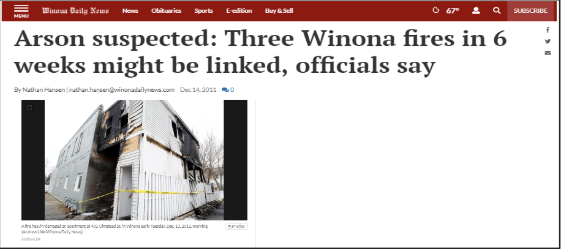
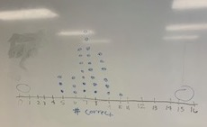

```{r echo=FALSE, message=FALSE, warning = FALSE}
library(tidyverse)
library(knitr)

hook_output = knit_hooks$get('output')
knit_hooks$set(output = function(x, options) {
  # this hook is used only when the linewidth option is not NULL
  if (!is.null(n <- options$linewidth)) {
    x = xfun::split_lines(x)
    # any lines wider than n should be wrapped
    if (any(nchar(x) > n)) x = strwrap(x, width = n)
    x = paste(x, collapse = '\n')
  }
  hook_output(x, options)
})

```

## Agenda

- Introductions
- Syllabus/Course Specifics
- What is Statistics?
- Software Set-up

---

## Announcements

- Introduction Questionnaire in Blueline due **Thursday August 24 at 11:59 pm**
  + Should take approximately 5 minutes
- Have *R* installed by Thursday if you do not do so in class today
  + Thursday in class we will get familiar with different features of *R*

<br>
<br>
<br>
**Look Ahead**: Sections covered next week in textbook: Chapter 1.1-1.3

---

## Alison Kleffner, PhD

- BS in Applied Mathematics and Economics at Rockhurst University
- Master and PhD in Statistics at University of Nebraska at Lincoln
- Thesis: *Visualization and Modeling of Multivariate Data in Environmental Applications*
- New Faculty! So I am learning and open to student research projects

--
<br>
<br>

**Now introduce yourselves!**

- Name
- Something fun you did this summer

---
class:inverse
<br>
<br>
<br>
<br>
<br>
<br>
<br>
<br>
<br>
<br>
.center[
## Course Information
]

---
## What will be in this course?

- Not a ton of calculations, but a lot of interpreting, reading, and writing.
- We will work with *R* code and output. If programming is new and hard to you, focus on the statistical concepts first!
- The labs and homework will be provided in both *R* file and PDF. Feel free to print it out and write.
- As a new faculty, I am learning and I am open to feedback

---
## Syllabus


---
class:inverse
<br>
<br>
<br>
<br>
<br>
<br>
<br>
<br>
<br>
<br>
.center[
## What is Statistics?
]

---
## What is Data?

- Data are plain facts, usually raw numbers.  Think of a spreadsheet full of numbers with no meaningful description. In order for these numbers to become information, they must be interpreted to have meaning.
- Collected on observational units.
- Can be in the form of counts, measurements, or responses.


---

## What is Statistics?

- Statistics is a branch of mathematical science that pertains to the collection, analysis, interpretation and presentation of data.
  + But it is not Math!
- It is applicable to a wide variety of disciplines from physical science to social sciences and humanities
  + Also used in everyday life - statistical literacy
- Helps us to make educated guesses about the unknown in an ocean of data

```{r, echo=FALSE, out.width="60%", fig.align='center'}

knitr::include_graphics("../images/Week1/stat-areas.png")

```

---
## Branches of Statistics

.pull-left[

**Descriptive statistics** are methods that describe, show, or summarize the data from our sample in a meaningful way.
  - Tables, charts, averages
 
```{r, echo=FALSE}

knitr::include_graphics("../images/Week1/graph-ex.png")

```
  
].pull-right[

**Inferential statistics** are methods that allow us to draw conclusions about the larger population that the sample represents.

```{r, echo=FALSE}

knitr::include_graphics("../images/Week1/inference.png")

```
  
]

---
## Arson Activity

+ I am a police detective in Winona, Minnesota, and everyone in this room is a suspect in the three fires that have been set in the last 6 weeks. I have called all of you in for questioning. Given are 16 questions I want you to answer about these fires. Please answer all 16 questions.
+ https://www.winonadailynews.com/news/local/arson-suspected-three-winona-fires-in-weeks-might-be-linked/article_492563a2-260a-11e1-9d03-0019bb2963f4.html  

.center[
```{r, echo=FALSE, out.width="60%", fig.align='center'}



```

]

---
## Arson Activity

**Answer True or False to the following questions:**

1. One of the fires was started using gasoline.
2. Matches were used to set the fires.
3. The trash was on the curb in front of the first house that caught on fire.	
4. There was a doghouse in the backyard at the scene of the second fire.
5. The residence of the third fire had off-street parking.				
6. The second residence had a screened porch.			
7. The suspected entered the first residence through the kitchen window.
8. The suspect left a flashlight behind at the scene of the second fire.
9. All three fires took place on Tuesdays.
10. The porch light was on at the residence where the first fire took place.
11. The third fire was started in the garage.
12. There was a dog barking at the house next door to the third fire.
13. The suspect wore work boots at the scene of the first fire.
14. The home security system was triggered when the suspect fled the scene of the third fire.
15. The lock on the back door at the first residence was broken.	
16. Multiple fires were set at the second residence.

---
## Arson Activity

**Count the number of correct answers:**

1. One of the fires was started using gasoline. - **F**
2. Matches were used to set the fires. - **T**
3. The trash was on the curb in front of the first house that caught on fire.	- **F**
4. There was a doghouse in the backyard at the scene of the second fire. - **F**
5. The residence of the third fire had off-street parking. - **T**				
6. The second residence had a screened porch.		- **T**	
7. The suspected entered the first residence through the kitchen window. - **T**
8. The suspect left a flashlight behind at the scene of the second fire. - **F**
9. All three fires took place on Tuesdays. - **F**
10. The porch light was on at the residence where the first fire took place. - **T**
11. The third fire was started in the garage. - **F**
12. There was a dog barking at the house next door to the third fire. - **T**
13. The suspect wore work boots at the scene of the first fire. - **T**
14. The home security system was triggered when the suspect fled the scene of the third fire. - **F**
15. The lock on the back door at the first residence was broken.	- **F**
16. Multiple fires were set at the second residence. - **F**


---
## Arson Activity

Before we look at results, let’s discuss some predictions first! With the people around you, discuss the following questions: 
+ If you are not the criminal, how many questions would you expect to get correct?
+ If you are the criminal, how many questions would you expect to get correct?


--
.center[
Let’s see how everyone did!

```{r, echo=FALSE, out.width="40%"}



```

]


---
class:inverse
<br>
<br>
<br>
<br>
<br>
<br>
<br>
<br>
<br>
<br>
.center[
##Software Set-Up
]

---

## What is R?

+ An open-source, free software environment
+ System for statistical computation and graphics
+ CRAN is *R*'s central software repository
  - Contains contributed packages
  
<br>
<br>
<br>
<br>

.center[ 
**It is OK if you never use it (or even heard about it) before! This is not a prerequisite for this course.**
]

---

## Installing R

1. Download and run the R installer for your operating system from CRAN
  - Windows: https://cran.rstudio.com/bin/windows/base/
  - Mac: https://cran.rstudio.com/bin/macosx/
  - Linux: https://cran.rstudio.com/bin/linux/
2. Now download RStudio from the RStudio website – IDE of R
 - https://posit.co/download/rstudio-desktop/
3. If you are using a Mac, you may need to download XQuartz.
https://www.xquartz.org/
 - If you run into issues, try downloading this to see if it helps.


Go with all default options
