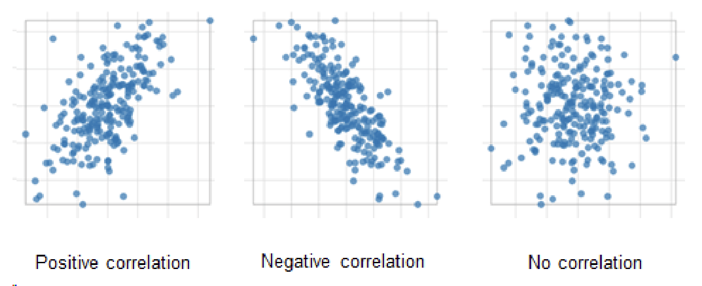
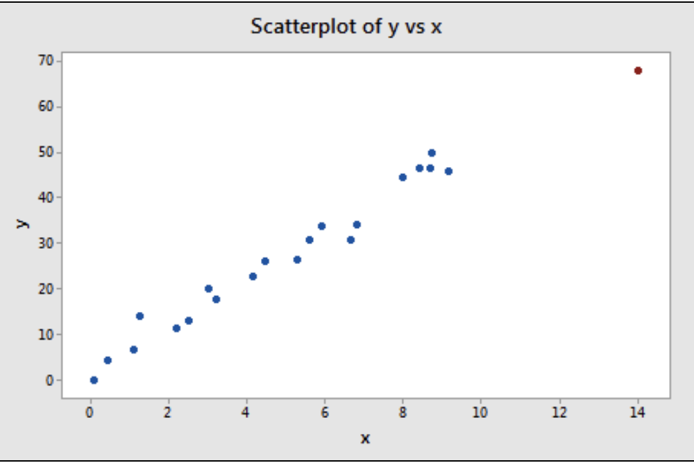
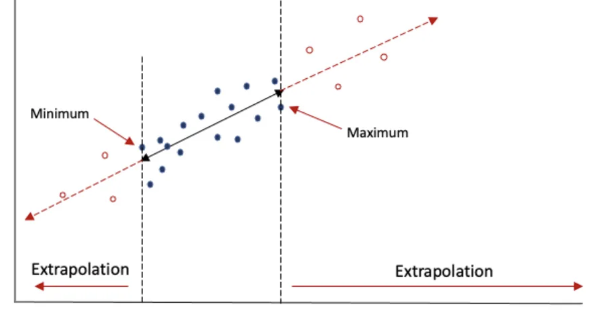

```{r echo=FALSE, message=FALSE, warning = FALSE}
library(knitr)

hook_output = knit_hooks$get('output')
knit_hooks$set(output = function(x, options) {
  # this hook is used only when the linewidth option is not NULL
  if (!is.null(n <- options$linewidth)) {
    x = xfun::split_lines(x)
    # any lines wider than n should be wrapped
    if (any(nchar(x) > n)) x = strwrap(x, width = n)
    x = paste(x, collapse = '\n')
  }
  hook_output(x, options)
})

```

```{css, include=FALSE}
.small-code .remark-code{
  font-size: 70%
}
```


### Announcements

+ Homework 7 due **tonight at 11:59pm**
+ Lab 9 on Thursday
  - Due **Friday November 3 at 11:59pm**
+ Homework 8 due **Tuesday November 7 at 11:59 pm**

+ Analysis Plan due **Tuesday November 14 at 11:59 pm**


**Today**: Section 6.1-6.3

---
### Notes from Lab 8

- Explain why ANOVA assumptions are met
- When we Fail to Reject the Null
  - Just means we don't have evidence for the alternative, not that we have evidence for the null
  - We are assuming the null hypothesis is true and trying to see if there is evidence against it (think of p-value definition)
- Include context in conclusions (mean of what?)


---
class: inverse

# Examining scatterplots

- Looking for a trend


- Measuring a trend with correlation

---
```{r xaringan-setup, include=FALSE}
library(xaringanthemer)
library(xaringanExtra)
style_duo_accent(primary_color = "#0054a6",
                 secondary_color = "#f1fffe",
  header_font_google = google_font("Source Sans Pro"),
  text_font_google = google_font("Source Sans Pro"))

#xaringanExtra::use_logo(
#  image_url = "https://upload.wikimedia.org/wikipedia/en/thumb/f/f2/Creighton_University_seal.svg/1200px-Creighton_University_seal.svg.png"
#)


xaringanExtra::use_tachyons()

xaringanExtra::use_tile_view()

knitr::opts_chunk$set(echo=FALSE, warning=FALSE, message=FALSE, fig.width=8, fig.height=5, cache=TRUE)

library(tidyverse)
library(RColorBrewer)
library(patchwork)
library(kableExtra)
library(oibiostat)
library(mosaic)
library(datasauRus)
```

## Relationships between variables

.bg-washed-blue.b--blue.ba.ph3[
__Example__: Demographic and cardiovascular risk factors were collected as part of the Prevention of Renal and Vascular END-stage Disease (PREVEND) study in the Netherlands. Data from 4,095 participants who completed cognitive testing and were part of the study for the full 10 year period are in the `prevend` data set. As adults age, cognitive function changes over time. The Ruff Figural Fluency Test (RFFT) is a measure of cognitive function that is designed to measure abilities like planning and multitasking. Scores range from 0 to 175 points. Is there a relationship between RFFT scores and age?
]

```{r, echo=FALSE}
library(oibiostat)
data(prevend)
```

---
## Relationships between variables

```{r, warning=FALSE, message=FALSE, echo=FALSE, fig.align='center'}
library(tidyverse)
prevend %>% ggplot(aes(x=Age, y=RFFT)) + geom_point(alpha=0.5) + labs(x='Age (years)', y='RFFT Score')
```

---

## Correlation

.bg-washed-yellow.b--yellow.ba.ph3[
__Correlation__: a measure of the strength and direction of the linear relationship between two numerical variables

- Denoted $R$ or $r$

- Correlation is bounded between -1 and +1
]

--

```{r, echo=FALSE}


```

---

## Correlation


--

- The closer $\vert R \vert$ is to $\pm 1$, the stronger the relationship

--

- $R>0$ when there is a postive association

--

- $R<0$ when there is a negative association

---

## Correlation

Correlation can be misleading... These all have a correlation of 0.8

```{r, echo=FALSE, fig.align='center'}
data(anscombe)

data <- tibble(x=c(anscombe$x1, anscombe$x2, anscombe$x3, anscombe$x4), 
               y=c(anscombe$y1, anscombe$y2, anscombe$y3, anscombe$y4),
               group=c(rep(1, 11), rep(2, 11), rep(3, 11), rep(4, 11)))

data %>% ggplot(aes(x=x, y=y)) + geom_point(aes(col=as.factor(group)), cex=2) + facet_wrap(~group) + guides(col=FALSE) 
```

---

## Correlation

```{r, echo=2}
data <- datasaurus_dozen %>% filter(dataset == "dino")
cor(data$x, data$y)
```

- This data set has a correlation very close to 0! What do you think it looks like?

--


```{r, echo=FALSE, fig.align='center'}
data %>% ggplot(aes(x=x, y=y)) + geom_point()
```

---


## Correlation

__Takeaway point__:

--

- Strong correlations do not guarantee a linear relationship!

--

- Zero correlation does not mean there is no relationship

--

.center[
.bg-washed-red.b--red.ba.ph3[Always plot your data first]
]

---

## Correlation

When we're working with a lot of numerical variables, it can be useful to calculate all pairwise correlations at once using a __correlation matrix__.

--

The PREVEND study is quite large! Let's look at correlations between just a few variables.

- `VAT` is a visual association score.
- `eGFR` is a measure of kidney function.
- `FRS` (Framingham risk score) is risk of a cardiovascular event in the next ten years.

.small-code[
```{r, echo=FALSE}
prevend2 <- prevend %>% select(Age, RFFT, VAT, BMI, eGFR, FRS)
kable(cor(prevend2))
```
]


---

## Correlation plot

We can visualize the pairwise correlations in a __correlation plot__.

```{r, eval=TRUE, echo=FALSE, fig.align='center'}
library(corrplot)
matrix <- cor(prevend2)
corrplot(matrix) #<<
```

---
## Correlation chart

Another option is to use a __correlation chart__. These plot the correlation _and_ the original data.

```{r, eval=TRUE, echo=FALSE, fig.align='center'}
library(PerformanceAnalytics)
chart.Correlation(prevend2)
```

---
class: inverse

# Estimating and interpreting a regression line

- Regression model: $y = \beta_0 + \beta_1 x$


- Interpreting regression coefficients


- Least squares estimation

---
## Simple Linear regression model

.def[
__Simple Linear regression model__: a simple way to model the relationship between an explanatory variable (X) and a response variable (Y) is with linear regression

$$Y_i = \beta_0 + \beta_1 X_i + \epsilon_i$$

- $\beta_0$: y-intercept
- $\beta_1$: slope

]

--

Based on our data, we "fit" the linear regression model:

$$\hat{Y}_i = \hat{\beta}_0 + \hat{\beta}_1 X_i$$

- $\hat{\beta}_0$ and $\hat{\beta}_1$ are the fitted _regression coefficients_

---

## Linear regression model

.bg-washed-blue.b--blue.ba.ph3[
__Example__: Researchers interested in how the human brain reacts to emotional stimuli recruited 16 couples in their mid-twenties who were married or had been dating for at least two years to participate in an experiment. The male partner's hand was zapped with an electrode while the female partner watched. As she watched, they measured the activity in several parts of the woman's brain that would respond to her own pain. They were looking for evidence of an "empathetic" response: that the female partner was sympathizing with how the male partner was feeling while being zapped. 

Brain activity was recorded as a fraction of the activity observed when the woman herself was zapped with the electrode. The women also completed a psychological test that measured empathy.

]

```{r, warning=FALSE, message=FALSE}
library(mosaic)
BrainEmpathy <- read.csv("../Week 11/BrainEmpathy.csv")
```

---

## Linear regression model

Did the women who scored higher on the psychological test for empathy have stronger reactions in the brain to their partner's pain?

1. Identify the repsonse and explanatory variable.
2. Write the linear model.

---
## Linear regression model

Wait, is a linear regression model appropriate?

--

```{r, fig.align='center'}
BrainEmpathy %>% ggplot(aes(x=Empathy, y=Brain_Activity)) + 
  geom_point() + geom_smooth(method='lm', se=FALSE)
```

The correlations in 0.542. Maybe...
---

## Linear regression model

Write the fitted linear regression model.

```{r, echo=FALSE}
x<- summary(lm(Brain_Activity~Empathy, data=BrainEmpathy))
x$coefficients
```

--

Thus we now have:

- $\hat{\beta}_0 = -0.0567$
- $\hat{\beta}_1 = 0.0073$
and the estimated linear model is $$\hat{Y}_i = -0.0567 + 0.0073X_i$$

---
## Linear regression model: Hypothesis Testing

Determining usefulness of a predictor variable in learning about the response

--

- $H_0$: There is no linear association between the predictor variable and the response variable

$$\beta_1 = 0$$
- $H_A$: There is a linear association between the predictor variable and the response variable

$$\beta_1 \neq 0$$
--

- Conclusion for slope: If p-value < $\alpha$ -> Reject $H_0$ -> We have evidence there is a linear association between the predictor variable and the response variable
  
--

```{r, echo=FALSE}
x$coefficients
```

---

## Predicted values

For any value of $X$, we can predict or estimate $\hat{Y}$ using the fitted linear model:

$$\hat{Y}_i = \hat{\beta}_0 + \hat{\beta}_1 X_i$$


.bg-washed-blue.b--blue.ba.ph3[
__Example__: A new couple comes to participate in this experiment. The female partner scores an 82 on the empathy assessment. Predict her brain response to the shocks given to her male partner.
]

---

## Residuals

.bg-washed-yellow.b--yellow.ba.ph3[
__Residuals__: the difference between the predicted value and observed value in a regression model, also called the "error"

$$e_i = Y_i - \hat{Y}_i$$
]

--

- Sometimes our model will overpredict, sometimes it will overpredict. Models are never perfect!


```{r, echo=FALSE, out.height="55%", out.width="55%", fig.align='center'}
knitr::include_graphics("../images/Week 11/residual.png")
```


---
## Residuals

.bg-washed-blue.b--blue.ba.ph3[
__Example__: Subject 2 had an empathy assessment score of 53, and a brain response of 0.392. Predict her brain response to the shocks given to her male partner, and calculate the residual.
]

--
<br>

.bg-washed-blue.b--blue.ba.ph3[
__Example__: Subject 3 had an empathy assessment score of 41, and a brain response of 0.005. Predict her brain response to the shocks given to her male partner, and calculate the residual.
]

---

## Least squares regression

Linear regression models are typically fit using a technique called __least squares regression__. The optimal fitted line is chosen such that:

1. The residuals sum to zero
2. The residuals squared are minimized


Essentially we want to minimize: $\sum^n_{i=1}(y_i - \hat{y}_i)^2$

---
## Evaluating Model : Coefficient of Dtermination $R^2$

- A number between 0 and 1 that measures how well a statistical model predicts an outcome
  + Provides a measure of how well observed outcomes are replicated by the model

- Amount of variation in the response variable that can be explained by the predictor variable

---
## Evaluating Model : Coefficient of Dtermination $R^2$

So going back to our Empathy vs. Brain Activity Example... 

```{r, echo=FALSE}

summary(lm(Brain_Activity~Empathy, data=BrainEmpathy))

```

--

29.4% of the variation in brain activity is explained by the empathy score


---
class: inverse

# Evaluating model conditions


- Regression assumptions


---

## Conditions for a linear model

There are four conditions a linear regression model must satisfy:

- __L__: $X$ and $Y$ must have a .blue[linear] relationship
- __I__: The individual observations, and therefore residuals, must be .blue[independent]
- __N__: The residuals must be .blue[normally] distributed with mean 0
- __E__: The .blue[errors] must have constant variance

Before you fit the model, you can check the linearity and the independence (if you know how the data is collected)

---
## Evaluating model conditions 

Use a scatterplot of the residuals against the fitted line to assess the assumptions of constant variance and independent residuals.

- What you want to see: random variation above and below zero with no pattern or "runs" (constant variance)

```{r, echo=FALSE, fig.align='center'}
model = lm(Brain_Activity~Empathy, data=BrainEmpathy)

plot(model, which = 1)
```

---

## Evaluating model conditions

Use a normal Q-Q plot to check whether the residuals are normally distributed

- What you want to see: most dots close to the diagonal line, with maybe a few deviations at the end

```{r, echo=FALSE, fig.align='center'}
plot(model, which = 2)
```

---
## Leverage and Outliers

- Leverage points: point that has a x value that is particularly high or low

- Outliers: points that do not follow overall pattern of association 
  + Outliers aren’t necessarily leverage points 


---

## Outliers 

.bg-washed-yellow.b--yellow.ba.ph3[
__Outlier__: a data point that stands out away from the pattern of the rest of data
]

Outliers can have a strong effect on the linear regression model.

__Standardized residuals__: 

$$\frac{e_i - \bar{e}}{s_e}$$

Standardized residuals greater than 2 are unusual. A point with a standardized residual greater than three should definitely be considered an outlier. 

- By the way, doesn't that look familiar?

---
## Leverage and Outliers

```{r, echo=FALSE}
knitr::include_graphics("../images/Week 11/outlier.png")
```

---
## Leverage and Outliers

```{r, echo=FALSE}

```

---

## Extrapolation

.bg-washed-yellow.b--yellow.ba.ph3[
__Extrapolation__: Using the regression line to predict beyond the range of observed data
]

```{r, echo=FALSE, fig.align='center', out.height="60%", out.width="60%"}

```


--

Extrapolation can be dangerous - no guarantee a trend will continue!

--

.bg-washed-blue.b--blue.ba.ph3[
__Example__: What would happen with a subject whose empathy score is 0?
]

