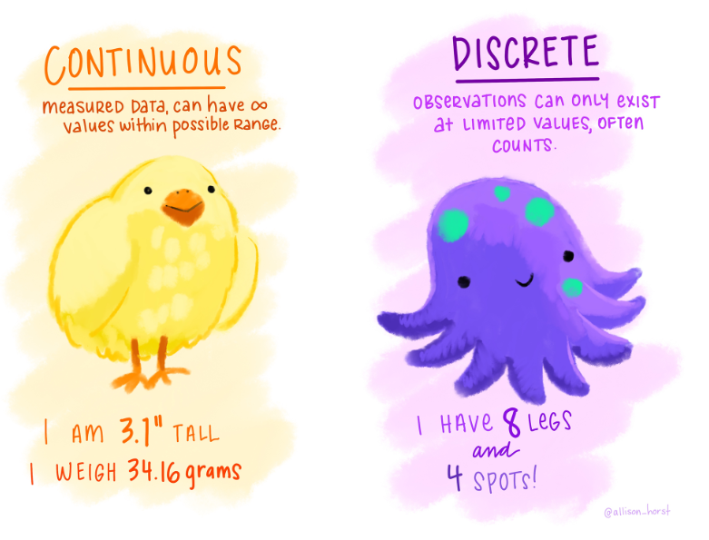

```{r echo=FALSE, message=FALSE, warning = FALSE}
library(tidyverse)
library(knitr)

hook_output = knit_hooks$get('output')
knit_hooks$set(output = function(x, options) {
  # this hook is used only when the linewidth option is not NULL
  if (!is.null(n <- options$linewidth)) {
    x = xfun::split_lines(x)
    # any lines wider than n should be wrapped
    if (any(nchar(x) > n)) x = strwrap(x, width = n)
    x = paste(x, collapse = '\n')
  }
  hook_output(x, options)
})

```


### Agenda

+ Describing Variables
  - Categorical vs Numerical
  - Explanatory vs Response

+ Data Collection:
  - Population vs Sample
  - Sampling Methods
  - Experimental vs Observation Studies
  - Designing an experiment: control, randomization, and replication

Sections covered today in Book: Chapter 1.1-1.3

---

### Announcements 

+ Intro Questionnaire due in Blueline at **11:59pm on Thursday August 24**

+ Homework 1 will be released after class today
  - Due **Tuesday August 29 at 11:59pm**
  - Upload to Blueline
  
+ Thursday's lab will be available on Blueline after class today. If you want to handwrite your lab, feel free to print it out and bring to lab

---

### Start with a Research Question

**Research Question**: A question that a research projects sets out to answer.

The research question decides what are your research subjects and how to conduct your research

**Examples**:

- Is smoking related to COVID-19's hospitalization rate?
- What is the main cause of depression among the youth?
- How does sleep affect your cholesterol levels?
- Does the current heart transplantation mortality rate at a hospital exceed the national rate?

Once you have a research question, you need to answer it. How?

--
<br>
.center[**Data!**]


---

### Let's Start with a Real Example...

In many Western countries the proportion of children with peanut allergies has doubled in the past ten years.

Some research suggests that early exposure to peanuts in small amounts may help prevent the development of allergies later in life.

The "Learning Early About Peanut Allergy" (LEAP) study was conducted to investigate **whether early exposure to peanut products reduces the probability that a child will develop a peanut allergy**.


If interested, here is a link for more information: https://peanutallergyfacts.org/2015/02/25/new-study-suggests-early-introduction-of-peanut-protein-reduces-prevalence-of-allergy-occurrence/

---

### Case Study: Preventing Peanut Allergies

- Enrolled 640 infants in the United Kingdom between 2006-2009
- Participants all had a diagnosed eczema, egg allergy, or both
- Infants participating in the study were randomly assigned to:
  + Peanut Group: Children consumed at least 6 grams of peanut protein per day until they turned 5 years old
  + No Peanut Group: Children avoided all peanut protein until they turned 5 years old
- At 5 years old, each child was tested for peanut allergy using an oral food challenge (OFC): 5 grams of protein in a single dose.
  + Pass: No allergic reaction was detected
  + Fail: An allergic reaction was detected
- Presented data from 530 children with an earlier negative skin test

--

<br>
<br>
.center[**Any red flags raised given how they collected the data?**]


---
### Case Study: Preventing Peanut Allergies

Data Collected in the Research:

```{r, echo = FALSE}
library(oibiostat)
data("LEAP")

head(LEAP[,1:4])
head(LEAP[,5:6])

```


**What columns are we most interested in?**

---
### Case Study: Preventing Peanut Allergies

A summary table makes it easier to identify patterns in the data

Below is an example of a two-way summary table

```{r, echo=FALSE}
table(LEAP$treatment.group, LEAP$overall.V60.outcome)
```

---
### Case Study: Preventing Peanut Allergies

```{r, echo=FALSE}
library(ggplot2)

x<- as.data.frame(table(LEAP$treatment.group, LEAP$overall.V60.outcome))

```

.pull-left[
Side-By-Side Bar Chart:
```{r, echo=FALSE}
x %>% ggplot(aes(Var2, Freq, fill = Var1)) + geom_bar(stat="identity", width=.5, position = "dodge") + xlab("Outcome") + ylab("Count")  + labs(fill="Treatment Group")

```

].pull-right[
Stacked Bar Chart:
```{r, echo=FALSE}
x %>% ggplot(aes(Var2, Freq, fill = Var1)) + geom_bar(stat="identity", width=.5, position = "fill") + xlab("Outcome") + ylab("Count")  + labs(fill="Treatment Group")
```

].center[**Which group was more likely to develop a peanut allergy?**]


---
### Statistics

We need Statistics to measure the difference in the previous example.

So, what is Statistics?

**Statistics** is the study of methods to describe and measure aspect of a population through a sample

Another definition: The study of how to **collect, analyze, and draw conclusions from the data**


---
### Describing a Data Set

In a data table (also called a data matrix, like the one below):

```{r, echo = FALSE}
head(LEAP[,1:4], n = 4)
head(LEAP[,5:6], n = 4)
```
<br>

- **Observations (n)**: each individual subject, case, or sample point (rows)
- **Variables (p)**: characteristics that are recorded for each subject in the sample (columns)

Describe the size of the data set as *n x p*

---

### Describing Variables

There are at least two ways to describe variables:

1. By Value Type:

  - **Numerical**: take on numerical values, where using mathematical operations (like addition, subtraction, etc.) are appropriate
  - **Categorical**: take on names, categories, or labels. Sometimes represented as numbers, but using mathematical operations are inappropriate.
  
  
---

### Variable Type:

.pull-left[

Types of Categorical Data
```{r, echo=FALSE, fig.align='center'}

knitr::include_graphics("../images/Week2/Categorical.png")

```


].pull-right[

Types of Numerical Data
```{r, echo=FALSE, fig.align='center'}



```

]
<br>
<br>
Artwork by @allison_horst


---
### Example as a Class

Classify the variables from the LEAP study as categorical or numerical:
<br>

```{r, echo = FALSE}
head(LEAP[,1:4])
head(LEAP[,5:6])
```

---

### Your Turn

**Example**: Suppose that on a given day, a research assistant collected data on the first 20 individuals visiting a walk-in clinic:

- age (measured as less than 21, 21-65, and greater than 65 years old)
- gender
- height
- weight
- reason for visit
- how many times they have visited before

<br>

Classify each of the variables


---

### Describing Variables

There are at least two ways to describe variables:


1. By Value Type:

  - Numerical: take on numerical values, where using mathematical operations (like addition, subtraction, etc.) are appropriate
  - Categorical: take on names, categories, or labels. Sometimes represented as numbers, but using mathematical operations are inappropriate.
  
2. By function (describes relationships between variables):
  
  - **Explanatory Variable** (independent, predictor): a secondary variable(s) that explains changes in the response variable
  - **Response Variable** (dependent): defined by the particular research question a study seeks to address, and measures the outcome of interest in the study

---
### Relationships Between Variables

**Example**: Read the scenarios below, and identify the most reasonable explanatory and response variables.
		
- For infants predisposed to developing a peanut allergy, is there evidence that introducing peanut products early in life is an effective strategy for reducing the risk of developing a peanut allergy?
- Does a recently developed drug designed to treat glioblastoma, a form of brain cancer, appear more effective at inducing tumor shrinkage than the drug currently on the market?
- Do bluefin tuna from the Atlantic Ocean have particularly high levels of mercury, such that they are unsafe for human consumption?

---
### Another Example

**Example**: Could cancer cells be selectively targeted by using antibodies recognizing a tumor-specific protein marker? Researchers grafted human cancerous cells onto healthy adult mice. Some of the mice were then injected with tumor-specific antibodies while others were not. The researchers wanted to study the number of mice exhibiting lymph node metastases in each group.
		
- What variables were recorded? Classify each variable as numerical or categorical.
- Which variable is the response variable and which variable is the explanatory variable?

---
### Data Description Summary

When you need to describe data for this class:
		
- Report the number of observations and variables in the data
- Identify response variable(s) and explanatory variable(s).
- Identify the value type for each variables
- Also, revisit your research question, comment on whether the data has enough information to answer your question.  

---
### Data Collection

Now, what if there is no data provided to you and you need to collect the data by yourself?

Outline:

- Population vs Sample
- Sampling Methods
- Experimental vs Observation Studies
- Designing an experiment: control, randomization, and replication

---
### Population and Sample

The **population** is the complete collection of ALL elements that are of interest. However, generally it is not possible to collect information from the whole population

So, as statisticians, we seek to understand more about a population based on data from a single **sample** 

```{r, echo=FALSE, fig.align='center', out.width="80%"}

knitr::include_graphics("../images/Week2/population_sample.png")

```

---
### Population and Sample

**Example**: Read the scenarios below, and identify the population of interest.
		
- For infants predisposed to developing a peanut allergy, is there evidence that introducing peanut products early in life is an effective strategy for reducing the risk of developing a peanut allergy?
- Does a recently developed drug designed to treat glioblastoma, a form of brain cancer, appear more effective at inducing tumor shrinkage than the drug currently on the market?
- Do bluefin tuna from the Atlantic Ocean have particularly high levels of mercury, such that they are unsafe for human consumption?

---
### Sampling from a Population

Samples are most useful for learning about a population when they are **representative**.The characteristics of the sample should **match** the characteristics of the population.
		
**Example**: Would our class data be representative of all Creighton students?


---
### Bad Sampling

**Example** Suppose that the quality improvement team at an integrated health care system, such as Harvard Pilgrim Health Care, is interested in learning about how members of the health plan perceive the quality of the services offered under the plan.

You have a staff waiting at the door of the health plan clinic and survey everyone entering the door

--

**Convenience sample**: individuals who are easily accessible are more likely to be included in the sample

In this scenario we would fail to enroll generally healthy members

---
### Simple Random Sample

**Example** Suppose that the quality improvement team at an integrated health care system, such as Harvard Pilgrim Health Care, is interested in learning about how members of the health plan perceive the quality of the services offered under the plan.

You randomly send surveys through mail to some members of the health plan

**Simple Random Sample**: each member of a population has the same chance of being sampled

--

<br>
.center[
**What if you have a high non-response rate?**]

--

.center[May have a biased sample]

---
### Other Useful Sampling Methods

```{r, echo=FALSE}

knitr::include_graphics("../images/Week2/sampling.png")


```

---
### Sampling Methods

**Example**: For the scenarios below, which sampling method would you recommend and why?
		
- Suppose researchers are interested in estimating the malaria rate in a densely tropical portion of rural Indonesia. There are 30 villages in the area, each more or less similar to the others. The goal is to test 150 individuals for malaria.
- It is common for health care facilities to follow up a patient visit with an email providing a link to a website where patients can rate their experience. Since the non-response rate for email is expected to be high, the facilities have decided to use a phone survey instead.
  - This health care facility is concerned following some reports of discriminatory treatment of minority patients, and they want to make sure that minority patients' experiences are well-documented.
  
---
### Let's Go Back to the Peanut Example

- Enrolled 640 infants in the United Kingdom between 2006-2009
- Participants all had a diagnosed eczema, egg allergy, or both
- Infants participating in the study were randomly assigned to:
  + Peanut Group: Children consumed at least 6 grams of peanut protein per day until they turned 5 years old
  + No Peanut Group: Children avoided all peanut protein until they turned 5 years old
- At 5 years old, each child was tested for peanut allergy using an oral food challenge (OFC): 5 grams of protein in a single dose.
  + Pass: No allergic reaction was detected
  + Fail: An allergic reaction was detected
- Presented data from 530 children with an earlier negative skin test

.center[**What if instead of assigning people to groups, we let the parents choose and report the consumption of small peanut amounts?**]


---

### Experimental vs Observation Studies

.pull-left[

**Experimental Studies**:

- *You* create the groups by what you choose to do to the people or objects.
  + *Manipulation* of groups
- Experience some particular condition (*treatment*)
- Ethical considerations

].pull-right[

**Observational Studies**:

- Groups you compare are *just there*
  - Data observed and collected on subjects
- Conclusions are limited
- Less ethical concerns


]

---
### Example: Experimental vs Observational Studies

**Example**: Read the study descriptions below. Is the study experimental or observational? What is the target population?
		
- Researchers randomly assign diabetes patients to two groups. In the first group, patients received a new drug called tasploglutide, whereas patients in the second group received standard treatment without the new drug. The researchers compared the rate of insulin release in the two groups.

- Psychologists tested whether the frequency of illegal drug use differs between people suffering from schizophrenia patients and those not having the disease. They measured drug use in a group of schizophrenia patients and compared it with that in a similar sized group of randomly chosen people.

---

### Three Principles of Experimental Design

**Control**: Researchers attempt to control outside variables by standardizing experimental conditions 

**Randomization**: Randomly assigning patients to treatment groups ensures that groups are balanced with respect to variables both we cannot control

**Replication**: Experiments should be repeated on a sufficiently large sample of data


---

### Three Principles of Experimental Design

There are two ideas of **control** in statistics:
		
- Control from the experimental design perspective (v.): Researchers attempt to control outside variables by standardizing experimental conditions
- Control group (n.): in an experiment, the control group serves as a basis for comparison. Placebo group, known treatment, etc.

In a study, we can **randomize** in several ways:
				
- Randomly select subjects to participate
- Randomly assign subjects to experimental treatments

**Replication** can be in one study or multiple study
		
- The study is conducted on multiple subjects
  + Have more than one observation per treatment group
- Replication study: a phenomenon in research where earlier studies are fully repeated to see if the results remain the same

---

### Why do We Need These Three Principles?

Amount of Ice Cream Sold vs Death by Drownings

```{r, echo=FALSE}

knitr::include_graphics("../images/Week2/ice-cream1.png")

```

---
### Why do We Need These Three Principles?

```{r, echo=FALSE, out.width="80%", fig.align='center'}

knitr::include_graphics("../images/Week2/ice-cream2.png")

```


**Confounding variable**: A variable (measured or not) related to both the explanatory and response variable
- Causes Bias

.center[
**Association does not justify causation**
]


---
### Data Collection Summary

What need to consider when collecting your data:
		
- Can we do an experimental study or does it have to be observational?
- Is there a group structure in the population that's available for you to use when selecting a sampling method?
- Is there any factors that may lead to a potential bias sample? 
  + eg: convenience sample due to the method or tools you choose
- Is the non-response rate is high?
- Have you collected all potential confounding variables? If there is one hard to collect, leave a comment. 

---
### Data Collection Summary

```{r, echo=FALSE}

knitr::include_graphics("../images/Week2/random.png")

```
