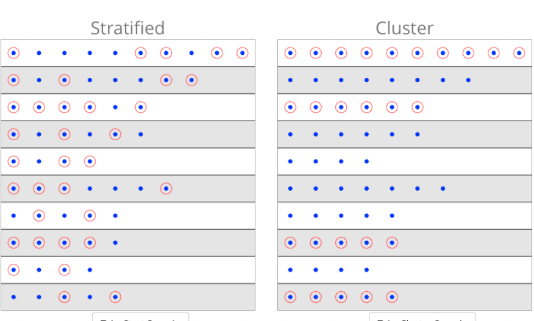
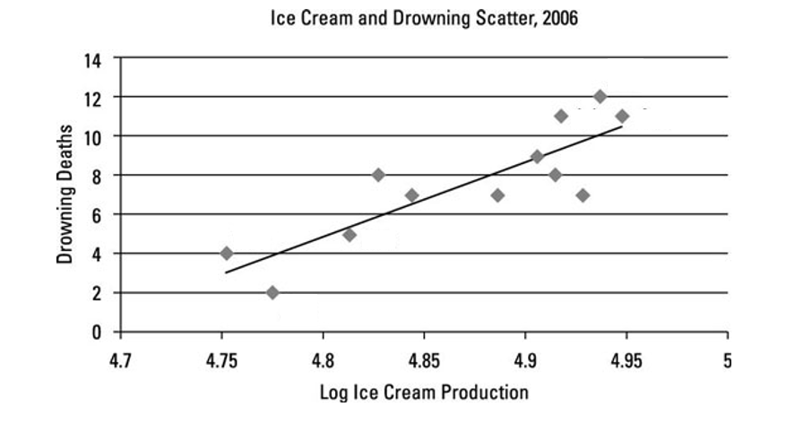
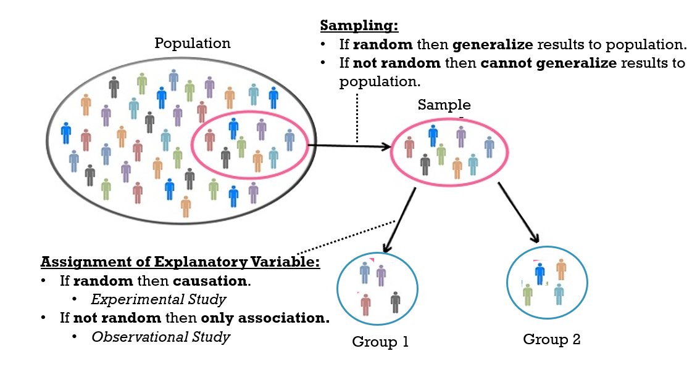

```{r echo=FALSE, message=FALSE, warning = FALSE}
library(tidyverse)
library(knitr)

hook_output = knit_hooks$get('output')
knit_hooks$set(output = function(x, options) {
  # this hook is used only when the linewidth option is not NULL
  if (!is.null(n <- options$linewidth)) {
    x = xfun::split_lines(x)
    # any lines wider than n should be wrapped
    if (any(nchar(x) > n)) x = strwrap(x, width = n)
    x = paste(x, collapse = '\n')
  }
  hook_output(x, options)
})

```

```{r, include = F, eval = T, cache = T}
clean_file_name <- function(x) {
  basename(x) %>% str_remove("\\..*?$") %>% str_remove_all("[^[A-z0-9_]]")
}
img_modal <- function(src, alt = "", id = clean_file_name(src), other = "") {
  
  other_arg <- paste0("'", as.character(other), "'") %>%
    paste(names(other), ., sep = "=") %>%
    paste(collapse = " ")
  
  js <- glue::glue("<script>
        /* Get the modal*/
          var modal{id} = document.getElementById('modal{id}');
        /* Get the image and insert it inside the modal - use its 'alt' text as a caption*/
        var img{id} = document.getElementById('img{id}');
          var modalImg{id} = document.getElementById('imgmodal{id}');
          var captionText{id} = document.getElementById('caption{id}');
          img{id}.onclick = function(){{
            modal{id}.style.display = 'block';
            modalImg{id}.src = this.src;
            captionText{id}.innerHTML = this.alt;
          }}
          /* When the user clicks on the modalImg, close it*/
          modalImg{id}.onclick = function() {{
            modal{id}.style.display = 'none';
          }}
</script>")
  
  html <- glue::glue(
     " <!-- Trigger the Modal -->

<!-- The Modal -->
<div id='modal{id}' class='modal'>
  <!-- Modal Content (The Image) -->
  
  <!-- Modal Caption (Image Text) -->
  <div id='caption{id}' class='modal-caption'></div>
</div>
"
  )
  write(js, file = "js-addins.html", append = T)
  return(html)
}
# Clean the file out at the start of the compilation
write("", file = "js-addins.html")
```

class:inverse

<br><br><br>
## MTH361: Probability and Statistics in the Health Sciences
### Introduction to Data and Data Collection
#### August 27, 2024


---
### Agenda

+ Case Study: Preventing Peanut Allergies

+ Describing Variables
  - Categorical vs Numerical
  - Explanatory vs Response

+ Data Collection:
  - Population vs Sample
  - Sampling Methods
  - Experimental vs Observation Studies
  - Designing an experiment: control, randomization, and replication

Sections covered today in Book: Chapter 1.1-1.3

---
### Announcements 

+ **Intro Questionnaire** due in Blueline at **11:59pm on Thursday August 29**

+ **Homework 1** will be released after class today
  - Due **Tuesday September 3 at 1:59 pm**
  - Upload to Blueline
  
+ **Thursday's lab** will be available on Blueline after class today. If you want to hand write your lab, feel free to print it out and bring to lab
  - Will be due **Friday August 30 at 11:59pm** in Blueline (but should have most of it done in class)

**Look Ahead**: Sections 1.4-1.7 covered next week

---

### Start with a Research Question

**Research Question**: A question that a research projects sets out to answer.

The research question decides what your research subjects are and how to conduct your research. They should be:

.pull-left[
- Clear
- Focused
- Complex
].pull-right[
- Relevant
- Researchable
- Concise

]


**Examples**:

- Is smoking related to COVID-19's hospitalization rate?
- What is the main cause of depression among the youth?
- How does sleep affect your cholesterol levels?
- Does the current heart transplantation mortality rate at a hospital exceed the national rate?


---

### Let's Start with a Real Example...

In many Western countries the proportion of children with peanut allergies has doubled in the past ten years.

Some research suggests that early exposure to peanuts in small amounts may help prevent the development of allergies later in life.

The "Learning Early About Peanut Allergy" (LEAP) study was conducted to investigate **whether early exposure to peanut products reduces the probability that a child will develop a peanut allergy**.
  - Research Question
<br>

If interested in this topic, you can find more information [here](https://peanutallergyfacts.org/2015/02/25/new-study-suggests-early-introduction-of-peanut-protein-reduces-prevalence-of-allergy-occurrence/)

---

### Case Study: Preventing Peanut Allergies

- Participants: 640 infants in the United Kingdom between 2006-2009
- Participants all had a diagnosed eczema, egg allergy, or both
- Started by using a skin test to see if infant currently had a peanut allergy.
  + 530 infants had a negative skin test, and continued.
- Infants were then randomly assigned to:
  + Peanut Group: Children consumed at least 6 grams of peanut protein per day until they turned 5 years old
  + No Peanut Group: Children avoided all peanut protein until they turned 5 years old
- At 5 years old, each child was tested for peanut allergy using an oral food challenge (OFC): 5 grams of protein in a single dose.
  + Pass: No allergic reaction was detected
  + Fail: An allergic reaction was detected


<br>
<br>
.center[**Any red flags raised given how they collected the data?**]


---
### Case Study: Preventing Peanut Allergies

Example of Data Collected in the Research (5 of 530 participants):

```{r, echo = FALSE}
library(oibiostat)
data("LEAP")

#head(LEAP[,1:4])
#head(LEAP[,5:6])

kableExtra::kable(LEAP[c(1:5,8),], col.names = c("ID", "Treatment", "Age (in Months)", "Sex", "Ethnicity", "Outcome")) 

```


**What columns are we most interested in?**

---
### Case Study: Preventing Peanut Allergies

A summary table makes it easier to identify patterns in the data

Below is an example of a two-way summary table

```{r, echo=FALSE}
table(LEAP$treatment.group, LEAP$overall.V60.outcome)
```


<br>
<br>

Can use a summary table to calculate proportions within each group

---
### Case Study: Preventing Peanut Allergies

```{r, echo=FALSE}
library(ggplot2)

x<- as.data.frame(table(LEAP$treatment.group, LEAP$overall.V60.outcome))

```

.pull-left[
Side-By-Side Bar Chart:
```{r, echo=FALSE}
x %>% ggplot(aes(Var2, Freq, fill = Var1)) + geom_bar(stat="identity", width=.5, position = "dodge") + xlab("Outcome") + ylab("Count")  + labs(fill="Treatment Group")

```

].pull-right[
Stacked Bar Chart:
```{r, echo=FALSE}
x %>% ggplot(aes(Var2, Freq, fill = Var1)) + geom_bar(stat="identity", width=.5, position = "fill") + xlab("Outcome") + ylab("Count")  + labs(fill="Treatment Group")
```

].center[**Which group was more likely to develop a peanut allergy?**]


---
### Statistics

We need Statistics to measure the difference in the previous example.

So, what is Statistics?

- **Statistics** is the study of methods used to describe and measure aspects of a population through a sample

- Another definition: The study of how to **collect, analyze, and draw conclusions** from the data


---
### Describing a Data Set

If we have a data set like the one below...

```{r, echo = FALSE}

kableExtra::kable(LEAP[c(1:4),], col.names = c("ID", "Treatment", "Age (in Months)", "Sex", "Ethnicity", "Outcome")) 

```
<br>

- **Observations (n)**: each individual subject, case, or sample point (rows)
- **Variables (p)**: characteristics that are recorded for each subject in the sample (columns)

Describe the size of the data set as *n x p*

---

### Describing Variables

There are at least two ways to describe variables:

1. By Value Type:

  - **Numerical**: take on numerical values, where using mathematical operations (like addition, subtraction, etc.) are appropriate
  - **Categorical**: take on names, categories, or labels. Sometimes represented as numbers, but using mathematical operations are inappropriate.
  
  
---

### Variable Type:

.pull-left[

Types of Categorical Data
```{r, results='asis', echo=FALSE, fig.align='center'}

i1 <- img_modal(src = "../images/Week2/categorical.png", alt = "Categorical Data")

c(str_split(i1, "\\n", simplify = T)[1:2],
  str_split(i1, "\\n", simplify = T)[3:9]
  ) %>% paste(collapse = "\n") %>% cat()

```


].pull-right[

Types of Numerical Data
```{r, results='asis', echo=FALSE, fig.align='center'}

i2 <- img_modal(src = "../images/Week2/numerical.png", alt = "Numerical Data")

c(str_split(i2, "\\n", simplify = T)[1:2],
  str_split(i2, "\\n", simplify = T)[3:9]
  ) %>% paste(collapse = "\n") %>% cat()

```

]
<br>
<br>
Artwork by @allison_horst


---
### Example as a Class

Classify the variables from the LEAP study as categorical or numerical:
<br>

```{r, echo = FALSE}
kableExtra::kable(LEAP[c(1:4, 8),], col.names = c("ID", "Treatment", "Age (in Months)", "Sex", "Ethnicity", "Outcome")) 

```

If categorical, is it ordinal or nominal? If numerical, is it continuous or discrete?

---

### Your Turn

**Example**: Suppose that on a given day, a research assistant collected data on the first 20 individuals visiting a walk-in clinic:

- age (measured as less than 21, 21-65, and greater than 65 years old)
- gender
- height
- weight
- reason for visit
- how many times they have visited before

<br>

Classify each of the variables


---

### Describing Variables

There are at least two ways to describe variables:


1. By Value Type:

  - Numerical: take on numerical values, where using mathematical operations (like addition, subtraction, etc.) are appropriate
  - Categorical: take on names, categories, or labels. Sometimes represented as numbers, but using mathematical operations are inappropriate.
  
2. By function (describes relationships between variables):
  
  - **Explanatory Variable** (independent, predictor): a secondary variable(s) that explains changes in the response variable
  - **Response Variable** (dependent): defined by the particular research question a study seeks to address, and measures the outcome of interest in the study
  
  
**Example**: Does receiving a monetary incentive increase the likelihood of a person responding to a survey?

---
### Relationships Between Variables

**Example**: Read the scenarios below, and identify the most reasonable explanatory and response variables.
		
- For infants predisposed to developing a peanut allergy, is there evidence that introducing peanut products early in life is an effective strategy for reducing the risk of developing a peanut allergy?
- Does a recently developed drug designed to treat glioblastoma, a form of brain cancer, appear more effective at inducing tumor shrinkage than the drug currently on the market?
- Do bluefin tuna from the Atlantic Ocean have particularly high levels of mercury, such that they are unsafe for human consumption?

---
### Another Example

**Example**: Could cancer cells be selectively targeted by using antibodies recognizing a tumor-specific protein marker? Researchers grafted human cancerous cells onto healthy adult mice. Some of the mice were then injected with tumor-specific antibodies while others were not. The researchers wanted to study the proportion of mice exhibiting lymph node metastases in each group.
		
- What variables were recorded? Classify each variable as numerical or categorical.
- Classify each variable as the response variable or explanatory.

---
### Data Description Summary

When you need to describe data for this class:
		
- Report the number of observations and variables in the data
- Identify response variable(s) and explanatory variable(s).
- Identify the value type for each variables
- Also, revisit your research question, comment on whether the data has enough information to answer your question.  

---
### Data Collection

Now, what if there is no data provided to you and you need to collect the data by yourself?

Outline:

- Population vs Sample
- Sampling Methods
- Experimental vs Observation Studies
- Designing an experiment: control, randomization, and replication

---
### Population and Sample

The **population** is the complete collection of ALL elements that are of interest. However, generally it is not possible to collect information from the whole population

So, as statisticians, we seek to understand more about a population based on data from a single **sample** 

```{r, echo=FALSE, fig.align='center', out.width="80%"}

knitr::include_graphics("../images/Week2/population_sample.png")

```

---
### Population and Sample

**Example**: Read the scenarios below, and identify the population of interest.
		
- For infants predisposed to developing a peanut allergy, is there evidence that introducing peanut products early in life is an effective strategy for reducing the risk of developing a peanut allergy?
- Does a recently developed drug designed to treat glioblastoma, a form of brain cancer, appear more effective at inducing tumor shrinkage than the drug currently on the market?
- Do bluefin tuna from the Atlantic Ocean have particularly high levels of mercury, such that they are unsafe for human consumption?

---
### Sampling from a Population

Samples are most useful for learning about a population when they are **representative**. The characteristics of the sample should **match** the characteristics of the population.

- ie. If it is similar to or represents the whole population from which it has been drawn


**Example**: Would our class data be representative of all Creighton students?

---
### Sampling from a Population

**Bias** : when the statistic consistently overestimates or underestimates the population parameter of interest.


**Another Example**: Would asking Creighton students enrolled in 8 am classes if they are morning people be representative of all Creighton students?


---
### Bad Sampling

**Convenience sample**: individuals who are easily accessible are more likely to be included in the sample

**Example** Suppose that the quality improvement team at an integrated health care system, such as Harvard Pilgrim Health Care, is interested in learning about how members of the health plan perceive the quality of the services offered under the plan.

You have a staff waiting at the door of the health plan clinic and survey everyone entering the door. Is this a good sample?

---
### Simple Random Sample

**Example** Suppose that the quality improvement team at an integrated health care system, such as Harvard Pilgrim Health Care, is interested in learning about how members of the health plan perceive the quality of the services offered under the plan.

You randomly send surveys through mail to some members of the health plan

**Simple Random Sample**: each member of a population has the same chance of being sampled

- How does it work?
  + You choose individually randomly from the sampling frame and each individual has the same chance of being selected.
  + A sampling frame is a list of all the individual in the population of interest
  
- If have randomization, we can generalize the results to the population


---
### Simple Random Sample

.center[
**What if you have a high non-response rate?**]

<br>
<br>
<br>
<br>
<br>

Example: If questions assume that participants are fluent in English, then a high non-response rate would be expected if the population largely consists of individuals who are not fluent in English
---
### Other Useful Sampling Methods: Blocking

```{r, echo=FALSE}




```

  
---
### Let's Go Back to the Peanut Example

- Participants: 640 infants in the United Kingdom between 2006-2009
- Participants all had a diagnosed eczema, egg allergy, or both
- Started by using a skin test to see if infant currently had a peanut allergy.
  + 530 infants had a negative skin test, and continued.
- Infants were then randomly assigned to:
  + Peanut Group: Children consumed at least 6 grams of peanut protein per day until they turned 5 years old
  + No Peanut Group: Children avoided all peanut protein until they turned 5 years old
- At 5 years old, each child was tested for peanut allergy using an oral food challenge (OFC): 5 grams of protein in a single dose.
  + Pass: No allergic reaction was detected
  + Fail: An allergic reaction was detected

.center[**What if instead of assigning people to groups, we let the parents choose and report the consumption of small peanut amounts?**]


---

### Experimental vs Observational Studies

.pull-left[

**Experimental Studies**:

- *You* create the groups.
  + *Manipulation* of groups
- Experience some particular condition (*treatment*)
- Ethical considerations
- Generally through some randomization aspect

**Example**: Students are randomly assigned to listen to classical music or country music before an exam. Then the two groups scores on the exam are compared

].pull-right[

**Observational Studies**:

- Groups you compare are *just there*
  - Data observed and collected on subjects
- Conclusions are limited
- Less ethical concerns

**Example**: Smokers/Nonsmokers vs. cancer


]

---
### Example: Experimental vs Observational Studies

**Example**: Read the study descriptions below. Is the study experimental or observational? What is the target population?
		
- Researchers randomly assign diabetes patients to two groups. In the first group, patients received a new drug called tasploglutide, whereas patients in the second group received standard treatment without the new drug. The researchers compared the rate of insulin release in the two groups.

- Psychologists tested whether the frequency of illegal drug use differs between people suffering from schizophrenia patients and those not having the disease. They measured drug use in a group of schizophrenia patients and compared it with that in a similar sized group of randomly chosen people.

---

### Three Principles of Experimental Design

**Control**: Researchers attempt to control outside variables by standardizing experimental conditions 
		
- Researchers attempt to control outside variables by standardizing experimental conditions
- Have a control group which serves as a basis for comparison (ie. Placebo group, known treatment, etc)

In a study, we can **randomize** in several ways:
				
- Randomly select subjects to participate (generalize to population)
- Randomly assign subjects to experimental treatments (can determine cause/effect)

**Replication**: Experiments should be repeated on a sufficiently large sample of data
		
- The study is conducted on multiple subjects
  + Have more than one observation per treatment group


---

### Why do We Need These Three Principles?

Amount of Ice Cream Sold vs Death by Drownings

```{r, echo=FALSE}



```

---
### Why do We Need These Three Principles?
.center[
```{r, echo=FALSE, results='asis'}
i2 <- img_modal(src = "../images/Week2/ice-cream2.png", alt = "",other=list(width="50%"))

c(str_split(i2, "\\n", simplify = T)[1:2],
  str_split(i2, "\\n", simplify = T)[3:9]
  ) %>% paste(collapse = "\n") %>% cat()


```
]

**Confounding variable**: A variable (measured or not) related to both the explanatory and response variable
- Causes Bias

.center[
**Association does not justify causation**
]


Randomly assigning objects to groups tends to balance out all other variables between the groups.

[More Examples](https://www.tylervigen.com/spurious-correlations)


---
### Data Collection Summary

What need to consider when collecting your data:
		
- Can we do an experimental study or does it have to be observational?
- Is there a group structure in the population that's available for you to use when selecting a sampling method?
- Is there any factors that may lead to a potential bias sample? 
  + eg: convenience sample due to the method or tools you choose
- Is the non-response rate is high?
- Have you collected all potential confounding variables? If there is one hard to collect, leave a comment. 

---
### Data Collection Summary

```{r, echo=FALSE}



```
