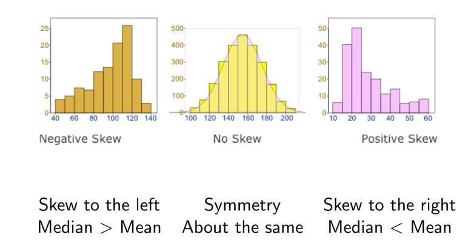

```{r echo=FALSE, message=FALSE, warning = FALSE}
library(tidyverse)
library(knitr)

hook_output = knit_hooks$get('output')
knit_hooks$set(output = function(x, options) {
  # this hook is used only when the linewidth option is not NULL
  if (!is.null(n <- options$linewidth)) {
    x = xfun::split_lines(x)
    # any lines wider than n should be wrapped
    if (any(nchar(x) > n)) x = strwrap(x, width = n)
    x = paste(x, collapse = '\n')
  }
  hook_output(x, options)
})

```


### Agenda

Exploratory Data Analysis:

- One Variable
  + Categorical
  + Numerical
- Two Variable
  + Two Numerical
  + Two Categorical
  + One Numerical and One Categorical
  
<br>
<br>
**Sections Covered**: 1.4-1.7

---
### Announcements


**Book Sections for Next Week**: Chapter 2

---
### Exploratory Data Analysis (EDA)

After describing the data, we also need to summarize and view the data's main characteristics.

Why?

- Further understand the data and variables
- Check missing values and potential outliers
- Help us to decide later modeling choices

How?
- Summary statistics
- Data visualization

Choosing an effective data display is a much a science as an art.


---
### A Quick Note on Good Graphics

Visualization is a method to communicate patterns in data to a wider audience. To do this effectively, the visualizations must be clear, honest, and efficient.

A Few Principles:

- Show the data
- Make patterns in the data easy to see
- Represent magnitudes honestly
- Make graphical elements clear


Note:

- All R code for producing the graphics and data summaries will use the `tidyverse` and `mosaic` libraries. The code can be found in the provided file in BlueLine, so you should be able to reproduce these graphics at home.

---
### Some Bad Graphics: COVID-19

.center[


```{r, echo=FALSE, out.width="45%"}

knitr::include_graphics("../Week 3/images/bad-pie.png")


```

]

.center[


```{r, echo=FALSE, out.width="60%"}

knitr::include_graphics("../Week 3/images/bad-scale.png")

```

]


---
### Case Study: ICU Admission Data

Data for a sample of 200 patients at an Intensive Care Unit (ICU). The data set contains 20 variables. Here is a list of the ones we will use in this example:

- Age
- Race
- Heart Rate
- Systolic
- Cancer: Yes/No
- Type: Elective/Emergency

---
class:inverse

<br>
<br>
<br>
<br>
<br>
<br>
<br>
<br>
<br>
.center[
# EDA for One Continuous Variable
]

---
### EDA for One Continuous Variable

- Measures of Center
  - Mean
  - Median
- Variability and Spread
  - Standard Deviation
  - Variance
  - Range and IQR
- Visualization
  - Box-plot
  - Histograms and Density Plots

---
### Measurse of Center

Sample Mean: average of all individuals in a sample
$$ \bar{x} = \frac{\sum^{n}_{i=1}x_i}{n} $$
Same median (*m*): middle observation when all the values are ordered from smallest to largest.

**Example**: We have a mean age of 57.5 and a median age of 63.


---
### Standard Deviation and Variance

**Sample Standard Deviation (s)**: a measure of spread in a data set, the "typical" distance between an individual observation and the sample mean.

$$s = \sqrt{\frac{1}{n-1}\sum^{n}_{i-1}(x_i - \bar{x})^2}$$
**Thus a typical range of data is between ** $\bar{x} \pm s$

- "Large" *s* indicates that the observations are typically far from the mean
- "Small" *s* indicates that observations are closely concentrated around the mean
- The "large" and "small" are relative

**Variance**: $s^2$
  
  - Variance has some nice mathematical properties, but it is less useful for interpreting data. Variance is useful in probability theory!
  
---
### Outliers

**Outliers** are unusual data points in the data set

A summary statistic is called **resistant** if its value does not change much when outliers are included

  - The median is a resistant summary statistic, whereas the mean and standard deviation are not
  
  
.center[


```{r, echo=FALSE, out.width="65%"}

knitr::include_graphics("../Week 3/images/mean-median.png")

```

]

---
### Range and IQR

Another way to describe the Variability:

  - Range: the interval between the minimum value and maximum value
  - Interquartile Range (IQR): the difference between the $75^{th}$ (Q3) and $25^{th}$ (Q1) percentiles
  
The definition of IQR is related to a boxplot and one of the way to define outliers.

---
### IQR and Boxplots
  
  
  
.center[


```{r, echo=FALSE, out.width="65%"}

knitr::include_graphics("../Week 3/images/IQR.png")

```

]

---
### Easy Calculation of Summary Statistics
  
Use the `favstats()` function in the  `mosaic` package. 

```{r, message=FALSE, eval = FALSE}
library(mosaic)
data <- read.csv("ICUAdmissions.csv")
favstats(data$Age) #gives statistical summaries
```


```{r, message=FALSE, echo=FALSE}
library(mosaic)
data <- read.csv("../Week 3/data/ICUAdmissions.csv")
favstats(data$Age) #gives statistical summaries
```


Can also use `summary()` but `favstats()` also provide total number of observations and number of missing values. 

---
### Visualizing the Distribution - Side Note

We can create a distribution of the `Age` variable with the `ggplot()` function. `ggplot()` is an additive function. The geom_histogram() function will add an new histogram "layer" to our plot. New layers can be added with a `+` sign.  

.pull-left[
```{r, message=FALSE}
data %>% ggplot(aes(Age)) 
```
].pull-right[
```{r, message=FALSE}
data %>% ggplot(aes(Age)) + 
  geom_histogram() #<<
```

]

---
#### Visualizing the Distribution


Use a histogram to capture the distribution (pattern of outcomes) of a variable

.pull-left[
```{r, message=FALSE}
data %>% ggplot(aes(Age)) + 
  geom_histogram() + #<<
  ggtitle("Histogram 30 Bins")
```
].pull-right[
```{r, message=FALSE}

data %>% ggplot(aes(Age)) + 
  geom_histogram(bins = 10) + #<<
  ggtitle("Histogram 10 Bins")
```

]

**Note**: Choose interval carefully as it may impact conclusions
  
---
### Visualizing the Distribution

Another option for the distribution of a continuous variable: density plot

.pull-left[
```{r, message=FALSE}

data %>% ggplot(aes(Age)) + 
  geom_density() + #<<
  ggtitle("Density Plot of Age")
```
].pull-right[
```{r, message=FALSE}

data %>% ggplot(aes(Age)) + 
  geom_density(fill="blue") + #<<
  ggtitle("Density Plot of Age")
```

]
  

---
### Describing the Distribution


Describing a Distribution:
  - Shape: symmetric/skewed?, mound-shaped (unimodal?, bimodal?)
  - Center: where does the center of the pattern appear? 
  - Variability: how spread out is the distribution?
  - Unusual data: Outliers?
  
  
---
### Describing the Distribution

**Skewness**: a measure of the asymmetry of the probability distribution of a continuous random variable about it's mean.

.center[


```{r, echo=FALSE, out.width="95%"}



```

]

---
### Exercise

Describe the Heart Rate variable using the given summary statistics and figure

.center[
```{r, echo = FALSE, message=FALSE}
j <- t(data.frame(c(summary(data$HeartRate), sd= sd(data$HeartRate), n= length(data$HeartRate), missing=sum(is.na(data$HeartRate)))))
rownames(j) <- NULL 

kableExtra::kable(j)

```
].pull-left[
```{r, echo = FALSE, message=FALSE}
data %>% ggplot(aes(HeartRate)) + geom_histogram() + ggtitle("Histogram of Heart Rate")
```
]

---
class:inverse

<br>
<br>
<br>
<br>
<br>
<br>
<br>
<br>
<br>
.center[
# EDA for One Categorical Variable
]

---
### EDA for One Categorical Variable

- Frequency Table
- Sample Proportion $(\hat{p})$: the proportion in a given category of interest

```{r, echo=FALSE}
data <- data %>% 
  mutate(Race = factor(Race, 
                    levels = c("1", "2", "3"),
                    labels = c("White", "Black", "Other")))

```

```{r}
table(data$Race)

data %>%    
  group_by(Race) %>%    
  summarise(count = n()) %>% mutate(prop = count/sum(count))

```

---
### EDA for One Categorical Variable

Visualization: Bar Charts

```{r, fig.align='center', fig.height=5}
data %>% ggplot(aes(x=Race, fill = Race)) + 
  geom_bar() #<<
```

---
### EDA for One Categorical Variable
Making a Good Bar Chart:
- Baseline of the y-axis should be at 0.
- For ordinal variables, the bars should be in the natural order. For nominal variables, best to arrange by frequency of occurrence. 

What's wrong with this example?

.center[


```{r, echo=FALSE, out.width="95%"}

knitr::include_graphics("../Week 3/images/bad-bar.png")

```

]

---
### Difference Between Bar-Plot and Histogram

- Histograms are for continuous variables; Bar plots are for categorical variables
- You can not switch the order of the histogram, but for most cases, it is OK to switch the bar order on a Bar Plot


.pull-left[
```{r, echo=FALSE}
data %>% ggplot(aes(x=Race)) + geom_bar() + ggtitle("Bar Plot of Race Distribution")
```
].pull-right[
```{r, echo=FALSE, message=FALSE}
data %>% ggplot(aes(Age)) + geom_histogram() + ggtitle("Histogram of Age Distribution")

```
]

---
class:inverse

<br>
<br>
<br>
<br>
<br>
<br>
<br>
<br>
<br>
.center[
# EDA for Two Contiuous Variables
]

---

### EDA for Two Contiuous Variables

- Numerical: Pearson Correlation Coefficient $(r)$: a measure of linear correlation between two sets of data (more in later chapters)
- Visualziation: Scatterplots

```{r, fig.height=5, fig.align='center'}

data %>% ggplot(aes(x=Systolic, y = HeartRate)) + 
  geom_point() #<<

```

---
### Interpretation of Correlation Coffiecient from Scatterplots


.center[


```{r, echo=FALSE, out.width="100%"}

knitr::include_graphics("../Week 3/images/correlation.png")

```

]

---
### Focus on Trend

If you want to focus on the trend of the data (the change in $y$-value with the increase of $x$-value):

- Line Plots
- Smooth Line Plots

Especially useful if want to show data over time

---
### Focus on Trend

.pull-left[
```{r}
data %>% 
  ggplot(aes(x=Systolic,
             y=HeartRate))+ 
  geom_line() + #<<
  ggtitle("Line Plot")
```
].pull-right[
```{r, message=FALSE}
data %>% 
  ggplot(aes(x=Systolic,
             y=HeartRate))+ 
  geom_smooth() + #<<
  ggtitle("Smooth Line Plot")
```
]


---
class:inverse

<br>
<br>
<br>
<br>
<br>
<br>
<br>
<br>
<br>
.center[
# EDA for One Contiuous and One Categorical Variable
]

---
### EDA for One Contiuous and One Categorical Variable

- Side-by-side box plots or density plots

```{r, echo=FALSE}
data$Infection <- as.factor(data$Infection)
```

.pull-left[
```{r, fig.height=6}
data %>% 
  ggplot(aes(y = HeartRate, 
            fill=Infection)) + 
  geom_boxplot() + #<<
  ggtitle("Box Plot of HR")

```
].pull-right[
```{r, message=FALSE, fig.height=6}
data %>% 
  ggplot(aes(x=HeartRate, 
          color=Infection)) + 
  geom_density() + #<<
  ggtitle("Density Plot of HR")
```
]

---
### EDA for One Contiuous and One Categorical Variable

- Plot continuous variable in multiple panels `(facet_grid)`

.pull-left[
```{r, fig.height=6}
data %>% ggplot(aes(x=HeartRate, 
        fill = Infection)) + 
  facet_grid(~Infection) + #<<
  geom_density() + #<<
  ggtitle("Box Plot of HR")

```
].pull-right[
```{r,  message=FALSE, fig.height=6}
data %>% ggplot(aes(x=HeartRate, 
          fill = Infection)) + 
  facet_grid(~Infection) + #<<
  geom_histogram() + #<<
  ggtitle("Hist of Heart Rate")

```
]

---
class:inverse

<br>
<br>
<br>
<br>
<br>
<br>
<br>
<br>
<br>
.center[
# EDA for Two Categorical Variables
]

---
### EDA for Two Categorical Variables

.pull-left[
+ Contingency Tables ("Two-Way" tables)

```{r, echo=FALSE}
data <- data %>% 
  mutate(Type = factor(Type, 
                       levels = c("0", "1"),
                       labels = c("Elective", "Emergency"))) %>% 
  mutate(Cancer = factor(Cancer, 
                       levels = c("0", "1"),
                       labels = c("Yes", "No")))

```

```{r}

table(data$Cancer, data$Type)

```
].pull-right[
+ Bar Plots on Multiple Panels

```{r}
data %>% 
  ggplot(aes(x=Cancer,
             fill=Cancer)) +
  facet_grid(~Type)+geom_bar()

```
]

---
### Exercise

A Medical Insurance Company data for almost 1000 customers, where the data is voluntarily given by customers.

.pull-left[
- Age
- Diabetes
- BloodPressureProblems
- AnyTransplants
- AnyChronicDiseases
- Height
].pull-right[
- Weight
- KnownAllergies
- HistoryOfCancerInFamily
- NumberofMajorSurgeries
- PremiumPrice
] 

For each of the following scenarios, which summary statistics and data visualization should you use?

(a). If you want to examine whether there is a relationship between Age and Premium Price (consider both as continuous variables) $\\$
(b). If you want to learn more information about people with a transplant. $\\$
(c) If you want to know the relation between whether someone has a transplant and the premium price. $\\$
(d) If you want to know whether having a transplant will related to whether people having any chronic diseases.

---
### Exercise (a)

Describe the relationship between Age and Premium Price.

The Correlation Coefficient is 0.698

```{r, echo=FALSE, fig.height=5, fig.align='center'}

med <- read.csv("../Week 3/data/Medicalpremium.csv")

med %>% ggplot(aes(x=Age, y = PremiumPrice)) + geom_point() + ggtitle("Scatterplot of Age vs Premium Price")
  
```

---
### Exercise (b)


Describe what you learned about people with a transplant.

.pull-left[
```{r echo=FALSE}
med <- med %>% 
  mutate(AnyTransplants = factor(AnyTransplants, 
                       levels = c("0", "1"),
                       labels = c("No", "Yes"))) 

kableExtra::kable(t(table(med$AnyTransplants)))

```
].pull-right[
```{r echo=FALSE}

med %>% ggplot(aes(x=AnyTransplants, fill = AnyTransplants)) + geom_bar() + theme(axis.ticks.x=element_blank())

```

]

---
### Exercise (c)

Describe the relationship between those with transplant & the premium price.

```{r, echo = FALSE}
colnames(med)[4] <- "Transplants"

kableExtra::kable(med %>% group_by(Transplants) %>% summarise(min = min(PremiumPrice), Q1=quantile(PremiumPrice, probs = 0.25),
                                               med=median(PremiumPrice), Q3=quantile(PremiumPrice, probs = 0.75), max = max(PremiumPrice), 
                                               mean = mean(PremiumPrice), sd= sd(PremiumPrice), n = n()))

```

.pull-left[
```{r, echo=FALSE, fig.height=6}
med %>% ggplot(aes(y = PremiumPrice, fill = Transplants)) + geom_boxplot() + ggtitle("Box Plot of Premium Price")

```
]


---
### Exercise (d)

Does having a transplant relate to whether people have any chronic diseases? Explain.

.pull-left[

```{r, echo=FALSE}
med <- med %>% 
  mutate(AnyChronicDiseases = factor(AnyChronicDiseases, 
                                 levels = c("0", "1"),
                                 labels = c("No", "Yes"))) 


tab2 <- table(med$Transplants ,med$AnyChronicDiseases)
names(attributes(tab2)$dimnames) <- c("Transplant","Chronic")
tab2

```


```{r, echo=FALSE, fig.height=6}
med %>% ggplot(aes(x=AnyChronicDiseases, fill = Transplants))+ facet_grid(~Transplants) + geom_bar() + ggtitle("Side-by-side bar plot of chronic diseases vs transplant")
```
]


