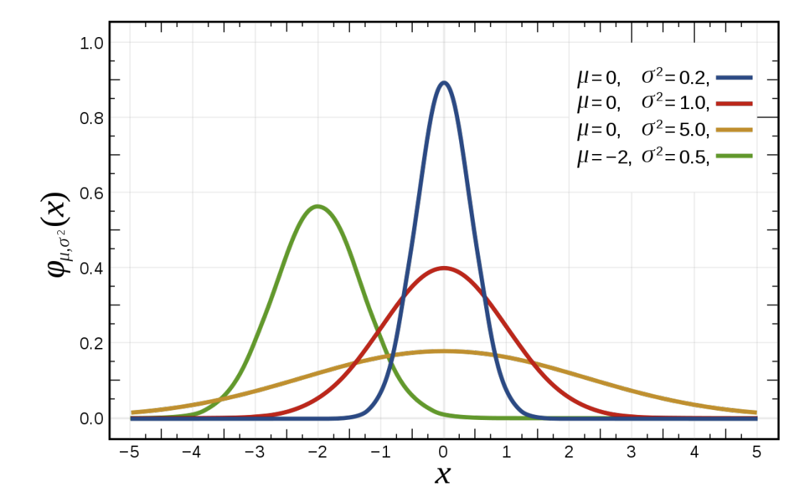

```{r echo=FALSE, message=FALSE, warning = FALSE}
library(knitr)

hook_output = knit_hooks$get('output')
knit_hooks$set(output = function(x, options) {
  # this hook is used only when the linewidth option is not NULL
  if (!is.null(n <- options$linewidth)) {
    x = xfun::split_lines(x)
    # any lines wider than n should be wrapped
    if (any(nchar(x) > n)) x = strwrap(x, width = n)
    x = paste(x, collapse = '\n')
  }
  hook_output(x, options)
})

```

### Agenda

- Probability distribution
- Random variable
- Normal distribution
- Properties of the Normal distribution
- Finding percentiles/quantiles from a Normal Distribution
- How do we know if a variable follows a Normal Distribution

---
### Announcements

---
### Random Variables


- Last week, we have talked about the probability of an event. e.g., let C be the even that a person is diagnosed with Cancer, we have P(C).
- Now suppose we have three people, and we are wondering what is the probability that exactly one of them is diagnosed with Cancer.
- You can either calculating the sum of all possible events, or use a random variable
- **Random variable** is a **function** that maps events to real numbers (or high dimensional real space)
- Let random variable X be the number of people diagnosed with Cancer, then the question is asking what is P(X = 1)

```{r, echo=FALSE, out.width="70%", fig.align='center'}
knitr::include_graphics("../images/Week5/random-variable.png")
```


---
### Probability Distribution

- Probability distribution: a list of the probabilities of all mutually exclusive outcomes of random variable
- Based on the potential outcomes of a random variable, we can classify random variables and their distribution into continuous and discrete. e.g., 
  + The number of people enter the clinic 
  + The proportion of people recovered with the new drug
- For discrete random variable, its probability distribution is called probability mass function (p(y))
- For continuous random variable, its probability distribution is called probability density function (f (y))


---
### Example: Let's Start with an Example

The forced expiratory volume (FEV, measured in liters) is a primary i ndicator of successful lung function and corresponds to the volume of air that can be forcibly be blown out in the first second after fully breathing in. A study of FEV on a sample of n = 654 children measured the children’s age, FEV, height, sex, and whether they had been exposed to second-hand smoke.
<br>
Let’s see the distribution of FEV and height.

.pull-left[
```{r, echo=FALSE}
library(tidyverse)
fev <- read.csv("data/FEV.csv")

fev %>% ggplot(aes(x=fev)) +
  geom_density(color="black", fill="darkblue")

```

].pull-right[
```{r, echo=FALSE}
fev %>% ggplot(aes(x=height)) +
  geom_density(color="black", fill="darkblue")

```

]

---
### Normal Distribution

+ Both variables’ distribution is a “bell-shaped curve”. We define the probability distribution that generates a perfect “bell-shaped curve” is called the normal distribution.
+ Normal distribution: a continuous probability distribution (any value in an interval is possible) that always describes a symmetric, bell-shaped curve with two parameters: mean $(\mu)$ and standard deviation $(\sigma)$.


```{r, echo=FALSE, out.width = "50%", fig.align='center'}

ggplot(data.frame(x = c(-3, 3)), aes(x = x)) +
        stat_function(fun = dnorm) + ylab("Density")

```

---
### Properties of the Normal Model

- Symmetric and unimodal about the mean $\mu$
- Probability distribution is highest at exactly $\mu$
- The standard deviation $\sigma$ controls the spread the distribution

```{r, echo=FALSE, fig.align='center'}

```

---

### Relationship between Density and Probability

- Density is not probability
- The area under the probability density function is 1
- Probability is measured by the area under the curve. e.g., the shaded area in the figure represents the P(−2 < X < 0)
- Note: For a continuous variable, at any point x, P(X = x) = 0

```{r, echo= FALSE, out.width="55%", fig.align='center'}
# Return dnorm(x) for 0 < x < 2, and NA for all other x
dnorm_limit <- function(x) {
    y <- dnorm(x)
    y[x > 0  |  x < -2] <- NA
    return(y)
}

# ggplot() with dummy data
p <- ggplot(data.frame(x = c(-3, 3)), aes(x = x))

p +
  stat_function(fun = dnorm_limit, geom = "area", fill = "blue", alpha = 0.2) +
  stat_function(fun = dnorm) + ylab("Density")
```


---
### Finding Normal Probabilities

The probability distribution for the normal distribution is:

$$f(x) = \frac{1}{\sqrt{2\pi\sigma^2}}e^{−(x−μ)^2/2\sigma^2}$$

How do we find the area under it?

 + Traditional chart reading with Z score
 + Use R as a calculator
 
 
---
### Z-Score

- Comparing and calculating values across different normal distributions can be tricky.
- One of the solution is to convert all normal distribution with different mean and standard deviation to a standard normal distribution.
- For a random normal distribution, we can always define a new random variable Z, such that

$$Z = \frac{X − \mu}{\sigma},$$
then Z will follow a standard normal distribution with mean equals to 0 and standard deviation equals to 1.

```{r, echo=FALSE, fig.align='center', out.width="50%"}
knitr::include_graphics("../images/Week5/standard-normal.png")
```

---
### Application: FEV

Assume forced expiratory volume (FEV) follows a normal model with $\mu$ = 2.64 and $\sigma$ = 0.87. Find the probability that a child has FEV less than 1.5.

Let X be the random variable of FEV.
$$P(X < 1.5) = P(\frac{X − \mu}{\sigma} < \frac{1.5 − \mu}{\sigma}) =$$ $$ P(Z < \frac{1.5 − 2.64}{0.87}) = P(Z < −1.31) $$

then check with the chart.

---
### Application: FEV

Assume forced expiratory volume (FEV) follows a normal model with $\mu$ = 2.64 and $\sigma$ = 0.87. Find the probability that a child has FEV less than 1.5.

```{r, echo=FALSE}
library(mosaic)
```


In the `mosaic` package in R, we have a function called `xpnorm`

```{r, message=FALSE, out.width="40%", fig.align='center'}
xpnorm(q=1.5, mean = 2.64, sd=0.87)
```

---
### Application: Birth Weights

The babies born in single births in the United States have birth weights that are approximately normally distributed with mean 3.3 kg and standard deviation 0.56 kg.

- What is the probability of a baby with a born weight between 3 kg and 4 kg?
- What is the probability of a baby with a born weight more than 5 kg?

---
### Probability of a baby with a born weight between 3 kg and 4 kg?
.pull-left[
`xpnorm(3, mean=3.3, sd=0.56)`
$\\$
If X ~ N(3.3, 0.56) then $\\$
P(Z $\leq$ -0.5357) = 0.2961


```{r, message=FALSE, echo=FALSE, out.width="90%"}
xpnorm(3, mean=3.3, sd=0.56)
```

].pull-right[
`xpnorm(4, mean=3.3, sd=0.56)`
$\\$
If X ~ N(3.3, 0.56) then $\\$
P(Z $\leq$ 1.25) = 0.8944 $\\$


```{r, message=FALSE, echo=FALSE, out.width="90%"}
xpnorm(4, mean=3.3, sd=0.56)
```

]
--
.center[

P(3 < X < 4) = P(-0.5357 < Z < 1.25) = 0.8944 - 0.2961 = 0.5983
]
---
### Probability of a baby with a born weight more than 5 kg?
.pull-left[
`xpnorm(5, mean=3.3, sd=0.56)`
$\\$ $\\$
If X ~ N(3.3, 0.56) then $\\$
P(X $\leq$ 5) = P(Z $\leq$ 3.04) = 0.9988002 $\\$
P(X > 5) = 1-P(Z $\leq$ 3.04) = 1-0.9988002 = 0.001199833
].pull-right[
```{r, message=FALSE}
1-xpnorm(5, mean=3.3, sd=0.56)
```
]

---
### Your Turn: Spy Height

It was rumored that Britain’s domestic intelligence service MI5 has an upper limit on the height of its spies, on the assumption that tall people stand out. (For the record - they deny this.) The rumor says that, to apply to be a spy, you can be no taller than 5 feet 11 inches (180.3 cm) if you are a man, and no taller than 5 feet 8 inches (172.7 cm) if you are a woman – supposedly to allow the spies to blend in with a crowd. Adult heights are known to be approximately normally distributed. For males, x ∼ Normal(177.0, 7.1) and for females, x ∼ Normal(163.3, 6.4).

+ What proportion of British males are eligible to apply to MI5?
+ What proportion of British females are eligible to apply to MI5?

Sketch a graph of both distributions to help you out.

---
### Your Turn: Spy Height
.pull-left[
If X ~ N(177.0, 7.1), then $\\$
P(X $\leq$ 180.3) = P(Z $\leq$ 0.4648) = 0.679 $\\$
P(X >  180.3) = P(Z >  0.4648) = 0.321 $\\$

```{r, out.width="60%", message=FALSE}
xpnorm(180.3, mean=177, sd=7.1)
```
].pull-right[
If X ~ N(163.3, 6.4), then $\\$
P(X $\leq$ 172.7) = P(Z $\leq$ 1.469) = 0.929 $\\$
P(X >  172.7) = P(Z >  1.469) = 0.07095 $\\$
	
```{r, out.width="60%", message=FALSE}
xpnorm(172.7, mean=163.3, sd=6.4)
```
]

---
### Empirical Rule

A simple rule for working with the normal model is the Empirical Rule:

- Approximately 68% of all probability in a normal model is within $\mu \pm \sigma$
- Approximately 95% of all probability in a normal model is within $\mu \pm 2\sigma$
- Approximately 99.7% of all probability in a normal model is within $\mu \pm 3\sigma$

```{r, echo=FALSE, fig.align='center'}
knitr::include_graphics("../images/Week5/empirical rule.png")
```


---
### Application: Birth Rate

The babies born in singleton births in the United States have birth weights that are approximately normally distributed with mean 3.296 kg and standard deviation 0.560 kg.

+ Give a range for the central 68% of all birth weights.
+ Give a range for the central 95% of all birth weights.
+ Give a range for nearly all birth weights (99.7%).

---
### Find the quantile for a random probability

What if the question is asking about a random probability?

Assume FEV follows a normal model with $\mu$ = 2.64 and $\sigma$ = 0.87. Find the lung capacity of the lowest 40% of children.

--
```{r, message=FALSE, out.width="45%", fig.align='center'}
xqnorm(0.40, mean=2.64, sd=0.87)
```
---
### Your Turn: Birth Rate

The babies born in singleton births in the United States have birth weights that are approximately normally distributed with mean 3.296 kg and standard deviation 0.560 kg.

+ Find the birth rate of the lowest 20% of babies
+ Find the birth rate of the highest 40% of babies

---
### Does the data ”fit” a normal model?

+ **QQ plot**: a quantile-quantile plot plots the sample values from our data against the corresponding ”theoretical quantiles” from a normal distribution using converted z-scores
+ The closer the QQ plot is to a straight line, the better our data ”fits” a normal model.
+ No QQ plot will be exactly perfect. Look for obvious deviations!

---
### What to expect in a QQ plot

The data sets below were all generated using a N(0, 1) model.

```{r, message=FALSE,fig.align='center', echo = FALSE, fig.height=7, fig.width=10}

set.seed(10)
data1 <- data.frame(value = rnorm(n=30, mean=0, sd=1), type = "Small (n=30)")
data2 <- data.frame(value = rnorm(n=100, mean=0, sd=1), type = "Medium (n=100)")
data3 <- data.frame(value = rnorm(n=300, mean=0, sd=1), type = "Large (n=300)")
data <- rbind(data1, data2, data3)
data$type <- factor(data$type, levels = c("Small (n=30)", "Medium (n=100)", "Large (n=300)"))

data %>% 
  ggplot(aes(x=value, fill = type)) + facet_wrap(vars(type)) + 
  geom_histogram(bins = 15)
```

---
### What to expect in a QQ plot

The data sets below were all generated using a N(0, 1) model.

```{r, message=FALSE, fig.align='center', echo = FALSE, fig.height=7, fig.width=10}
data %>% ggplot(aes(sample=value, color = type)) + facet_wrap(vars(type)) +
  stat_qq() + stat_qq_line()
```


---
### What to expect in a QQ plot

What happens when we have clearly non-normal data sets?


```{r, echo=FALSE, fig.align='center', fig.height=7, fig.width=10}
set.seed(12345)
data1 <- data.frame(value = c(rbeta(15, 10, 3), rbeta(15, 3, 10)), type = "Bimodal")
data2 <- data.frame(value = rbeta(30, 10, 3), type = "Left Skew")
data3 <- data.frame(value = rbeta(30, 3, 10), type = "Right Skew")

data <- rbind(data1, data2, data3)

data %>% 
  ggplot(aes(x=value, fill = type)) + facet_wrap(vars(type)) + 
  geom_histogram(bins = 15)
```


---
### What to expect in a QQ plot

What happens when we have clearly non-normal data sets?

```{r echo=FALSE, fig.align='center', fig.height=7, fig.width=10}
data %>% 
  ggplot(aes(sample=value, color = type)) + facet_wrap(vars(type)) + 
  stat_qq() + stat_qq_line()
```


---
### Application: Height

Would it be reasonable to model height of children using a normal distribution?

```{r echo=FALSE, fig.align='center', fig.height=6.5, fig.width=10}
fev %>% 
  ggplot(aes(sample=height)) +
  stat_qq() + stat_qq_line()
```

---
### Application: Height
Would it be reasonable to model height of children using a normal distribution?

```{r echo=FALSE, fig.align='center', fig.height=6.5, fig.width=10}
fev %>% 
  ggplot(aes(sample=height, color = sex)) + facet_wrap(vars(sex)) + 
  stat_qq() + stat_qq_line()
```


```


